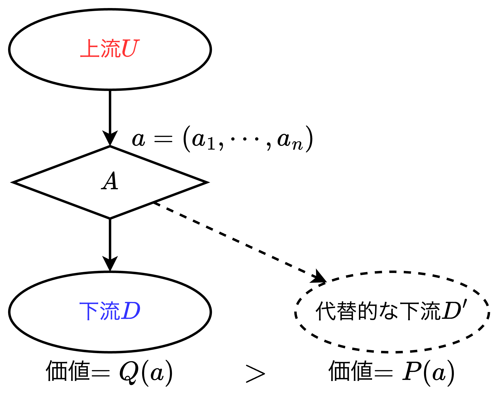
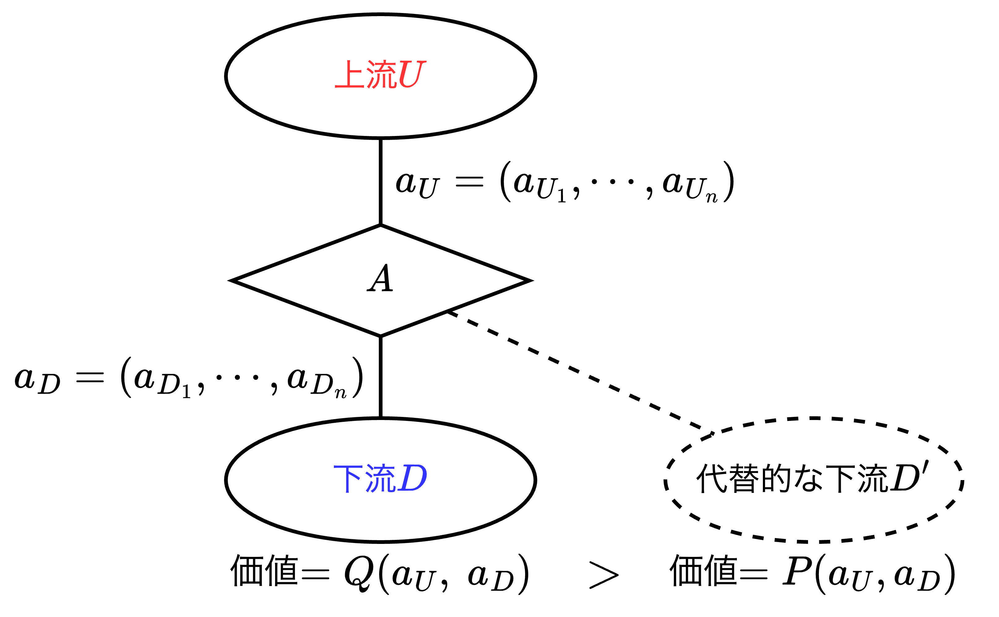
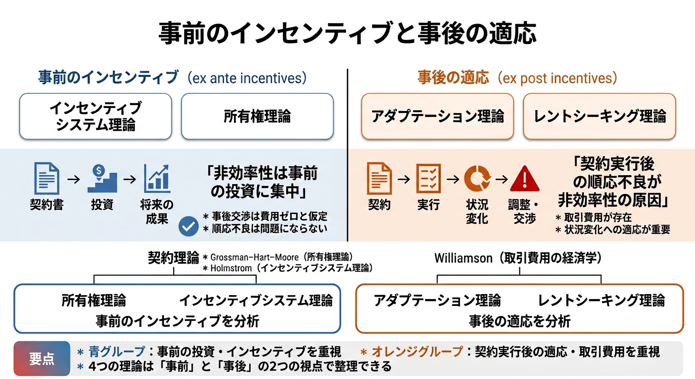

# A-4章 企業の境界論の実証研究

## 初期の実証研究

- 

## 初期の実証研究の問題点

- 

## 第2世代の実証研究の発展

- 

## 上流・下流の双方が投資を行うモデル

#### 【復讐】垂直的な生産関係

- 上図はギボンズによる垂直的な生産関係を示す図である。本節では前章冒頭の復習をする。
- 【**再掲：事前知識1**】製造設備などの物的資産の所有権（$\text{ownership of asset}$）の所在は生産される中間財の所有権（$\text{ownership of intermediate good}$）の所在を決める。
- 【**再掲：数式の定義**】まず、資産か機械である$A$がある。上流$U$は$A$を使用して複数の活動・職務（$\text{multi-task}$）のアクション$a=(a_1,\;\cdots,\;a_n)$をとる。そして中間生産物が生産される。この中間生産物は下流$D$もしくは$D'$に行きうる。しかしアクション$a$は$D$に対する**特殊的投資**、あるいは$A$は$D$に対する**特殊的な機械・資産**であるので中間生産物自体は全く同じ財であるが、中間生産物が$D$に行った場合の価値$Q(a)=\{Q_1,\;\cdots,\;Q_I\}$、は$D'$に行った場合の価値$P(a)=\{P_1,\;\cdots,\;P_J\}$より大きい（$Q>P$）。これが<b>特殊性</b>の尺度を表す。$Q$と$P$の確率密度関数$f$は$Q_i$が$P_j$より大きい時だけ正の値をとる（$\color{red}f(Q_i,\;P_j)>0\quad\text{if only}\quad Q_i>P_j$）。$Q$と$P$の値は観察可能（$\text{observable}$）であるが第三者に立証可能（$\text{verifiable}$）ではない。

【**非統合／アウトソーシングの場合**】$U$は$A$を所有している場合

- $U$が$A$を所有しているので中間財の所有権は$U$にある。このとき$U$は$a$を実行し、$A$を用いて中間財を生産し、そして$U$は「$D$に売ろうか、$D'$に売ろうか」と考える。このとき$U$は「**独立した契約者（$\text{independent contractor}$）**」
- 非統合では交渉（バーゲニング）が発生する。私（$U$）は$D$に「あなたが$Q$の支払いを私にしてくれれば嬉しい」という。これに対し、$D$は$U$に「私はそうは思わない、あなたは$D'$に売ることになれば$P$しか得ることができない。私はあなたに$P$の支払いをしようと思う。」という。上記の交渉を経て、非統合では交渉が発生し、支払額は$\left(\;Q(a)+P(a)\;\right)/2$で決着がつく。非統合において$U$が実行する$a$に対する業績給（$\text{pay-for-performance}$）が$\left(\;Q(a)+P(a)\;\right)/2$として発生し、いわば**インセンティブ契約**（ある種のインセンティブスキーム）のようになっている。この例では1回だけスポットで取引を行っているので「**スポットアウトソーシング（$\text{spot outsourcing}$）**」と呼ばれる。
- $U$は$a$を行うインセンティブを有するが、そのインセンティブの良し悪しはわからない。例えば、$Q$を跳ね上げても$U$はその半分$Q/2$のリターンを得るに過ぎない。ベストケースは$a$の全てが$Q$を跳ね上げる効果を持ち、$P$については効果を持たない場合であり、最悪のケースはアクションが$Q$に対しては何の効果も持たず$P$の跳ね上げだけに帰結する場合である（**大いなる浪費**）。

【**統合／雇用の場合**】$D$は$A$を所有している場合

- $D$が$A$を所有しているので生産される中間財の所有権は$D$にある。従って、$D$は$U$に「$a$を実行してくれてありがとう。ところで、この中間財を$D'$に提案することさえ考えてはいけない。なぜなら中間財は私（$D$）のが所有しているのだから。」と言う。この場合、$U$は所有していない$A$を使用しているので、$U$は「**従業員（$\text{employee}$）**」と呼べる。
- $U$が仕事により中間財を生産し、それを$D$が所有する。**インセンティブ契約は出てこない**、極めて単純である。1回限りの「**スポット雇用（契約）**」の下では、$Q$と$P$の価値が実現して、$D$が生産された中間財を所有する。この状況で、$U$が投入する努力量は理論上$"\bold{ゼロである}"$。なぜなら支払いはなされないからである。
- これは後述する$\text{Clive Bull}$の主観的ボーナスモデル（$\text{subjective bonus model}$）の1回限りのワンショットバージョンの場合に類似している。すなわち、<u>ワンショット（1回限りの）ゲームにおいて、均衡は$D$が$U$に支払いを行わないから、$U$は仕事をしないと言うことになる</u>。そこで質問である。この$U$の投入努力量ゼロは非統合の場合よりベターとなる可能性があるだろうか。答えはイエスである。なぜなら仮に全てのインセンティブが$P$を跳ね上げる効果を持っているのであれば、それは莫大な浪費になるからだる。どちらがより大きな余剰を生み出すかは明確ではない。

#### 1部門投資モデル（$\text{one-sided investment}$）

- 以上の復習を踏まえ、$U$のみが$a$をとるので「**1部門投資（$\text{one-sided investment}$）のモデル**」と呼ぶ。これは簡単なケースである。非統合の場合、$U$は働き、生産された中間財は$U$が所有する。それから$U$は$D$に「中間財を$D'$に売ることを考えている。ついては$P$以上の支払いをするつもりはないか？」と交渉する。このとき、2つのケースを考える。
  - 【**ケース1**】$Q=a_1+ka_2,\;P=a_1$とし、$k$は小さい値とする。この例では$a_1$に対して強いインセンティブを持っている。$k$の値が小さければメカニズムはかなりうまく動く。
  - 【**ケース2**】$Q=a_1,\;P=a_1+ka_2$とし、$k$は大きい値とする。この例では、潜在的に$a_2$に強いインセンティブがあり、大きな浪費となる。この点はパラメータの状況次第である。

#### 2部門投資モデル（$\text{two-sided investment}$）

- $\text{Woodruff（2002）}$と$\text{Baker and Hubbard（2004）}$に到達するためにここで我々は二者が同時にアクションを取る（投資する）、「**2部門投資（$\text{two-sided investment}$）のモデル**」を導入する。すなわち、$U$はマルチタスクのアクション$a_U=(a_{U_1},\cdots,a_{U_n})$をとる。$D$もマルチタスクのアクション$a_D=(a_{D_1},\cdots,a_{D_n})$をとる。そして実現する価値は彼らの取るアクションとアウトサイドオプション（**交渉がまとまらなかったときに得られる別の選択肢や代替案**）に依存する。

## 所有権理論の実証

- 

### メキシコの靴産業の構造

- 

### 異なる所有構造に応じた異なるホールドアップ

- 

## 所有権理論の実証2

- 

### トラック運送と契約可能性

- 

### データと契約形態の変化の分析方法

- 

### トラック運送におけるOBCsの採用と雇用運転手との関係

- 

## 企業の境界論の中間的まとめ

- なぜ所有権理論は人気があるのだろうか。$\text{Gibbons（2005a）}$は30年に及ぶ企業の境界論の研究史を4つのフォーマルモデルを類型化した。企業の境界論の発展のパターンは1971年（$\text{Williamson［1971］}$）に始まって以来、取引費用の連続だった。$\text{Holmstrom（1999b）}$のインセンティブシステム理論のアイデアは1999年であるし、アダプテーション理論は$\text{Simon（1951）}$がきっかけである。<u>所有権理論が人気がある理由の一つは長い間、取引費用の経済学に対する唯一の代替案であったこと、そして、唯一のフォーマルなモデルであったこともある</u>。
- フォーマルな契約は起きることが確信できるという意味で優れている。しかし、$2kg$の塩の袋を取引する場合と違い、一般の取引は簡単ではない。契約の履行について、暗黙的あるいは明示的な保証があるか否かについて幾分かの疑義があるにもかかわらずあなたを信用しなければならない。あなたが明示的な保証があると主張する場合でも、それは「あなたは私に実際にそれを約束します。」という意味での明示性であり、言葉の上だけのものである。このため、私はあなたの履行状況をモニターする必要があり、違反に対しては処罰を行う必要がある。
- フォーマルな契約に欠点が生じる場合、関係性（$\text{relationships}$）が必要となる（関係的契約）。しかし、関係性のうちには信頼とは逆のものが含まれており、信頼は破られうる。約束は守られない可能性がある。A-8章でのべる（$\text{Bull（1987）}$）の関係的契約の分析やこれを豊かにした$\text{Baker, Gibbons and Murphy（2002）}$でこの点は明確となった。

#### 企業の境界論の4モデルの区分

-  企業の境界論を4つに類型化において、「事前のインセンティブ」と「事後の適応」のいずれかにグルーピングすることができる。
   - 【**「事前」のインセンティブに対する効果を考える理論**】①$\text{Holmstrom}$のインセンティブシステム理論、②$\text{Grossman-Hart-Moore}$の所有権理論
   - 【**「事後」の適応に対する効果を考える理論**】$\text{Williamson}$を源流とする2つの理論、③アダプテーション理論、④レントシーキング理論
- 理論には多くの可能性があり、事前のアクションと事後のアクションについて以下の可能性がある。
  - 【**事前のアクション（$\text{ex ante actions}$）**】契約可能か否か、譲渡可能か否か。
  - 【**事後の意思決定（$\text{ex post decisions}$）**】契約可能か否か、譲渡可能か否か。
- これらの可能性の問いは、単に基本的なモデルを想定するだけでなく、多くの要素を詰め込み、モデルを結合できる。例えば、所有権理論は以下のようになる。
  - 【**所有権理論における事前のアクション（$\text{ex ante actions}$）**】事前に契約不能で、譲渡不能なアクション。
  - 【**所有権理論における事後の意思決定（$\text{ex post decisions}$）**】事後は契約可能で、譲渡可能な意思決定である。

**レントシーキング理論が語るもの**

- 抽象的に考える代わりに、モデルが何を我々に語っているかで見る。まずレントシーキング型の企業の境界論である。大きな専有可能な準レント（$\text{appropriable quasi-rents}$）、すなわち争い合う対象物を有している時、我々は争う。争いの対象物が多くなれば多くなるほど、争いに勝とうとして非効率性が大きくなる。これは望ましくない。ウィリアムソンはレントシーキング理論を次のように述べている。「**命令（統合されたコントロール）はしばしば交渉（駆け引き）よりも効率的である**」と。その意味で命令や所有権（$\text{ownership}$）はレントシーキングをやめると言うものである。このため、レントシーキング型の企業の境界線とその実証研究は非統合についての悪いニュースについてのものである。言い方を変えると、統合の便益についてのものである。

**所有権理論が語るもの**

- レントシーキング理論の分析では非統合の非効率性を挙げ、統合の有用性を述べた。では、統合のコストはないのだろうか。所有権理論はこれに対する答えを用意している。**所有権理論が人気があるもう一つの理由である**。
- $\text{Woodruff（2002）}$のメキシコの靴産業の研究を思い起こせば、非統合の下では川下の小売店舗のオーナーは顧客の嗜好を把握するインセンティブを持つ。このため、小売店舗のオーナーによる投資が本当に重要であるならば、非統合が正しい選択となる。たとえ、川上の製造事業者が心配に感じる状況になっても、川下の小売店舗のオーナーが安心に感じられる選択が正しい。そして、<u>小売店舗のオーナーが安心に感じられる選択は「**非統合**」である</u>。
- 他方で、**非統合**すなわち川下の小売店舗の店長自身が店舗を所有している時、川上の製造事業者がホールドアップされ、自分の作った靴が良くないと川下の小売店から言いがかりをつけられることを非常に心配していたらどうするか。できることは、製造事業者が小売店舗を統合する「前方への統合（$\text{forward integration}$）」である。結果、製造事業者が店舗を所有することとなる。この場合、統合のコストは何だろうか。小売店舗の店長に進取の精神を喪失させることである。なぜなら、店長は製造事業者が自分の進取の精神にむくいないことを心配するからである。統合された今、店長は製造事業者の下で働くことになるわけで、製造事業者はいつでも店長を解雇することができる。あるいは、店長がしっかりと顧客の嗜好性をつかんだとしても、それにむくいずボーナスを支払わないことができるのである。

