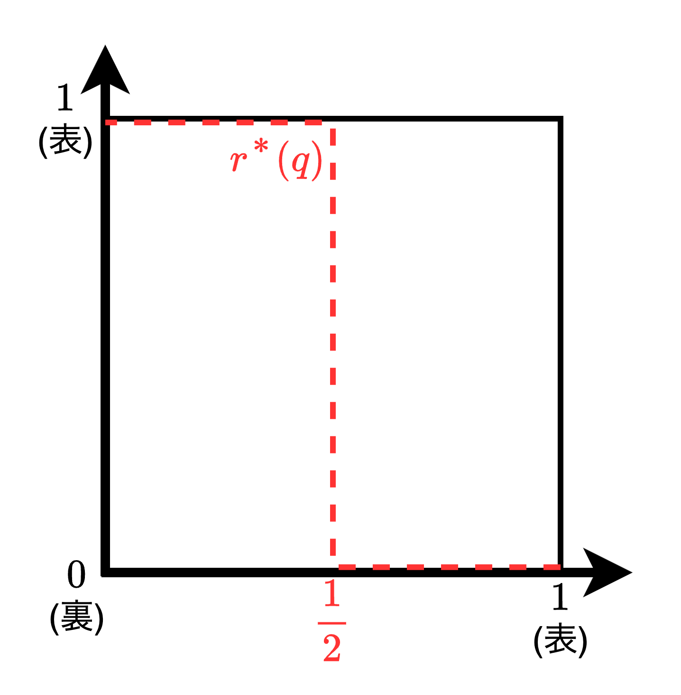
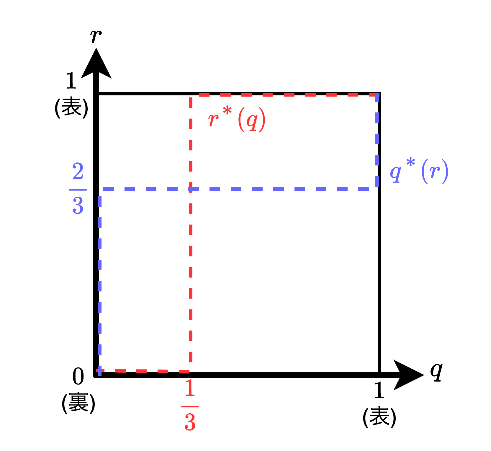
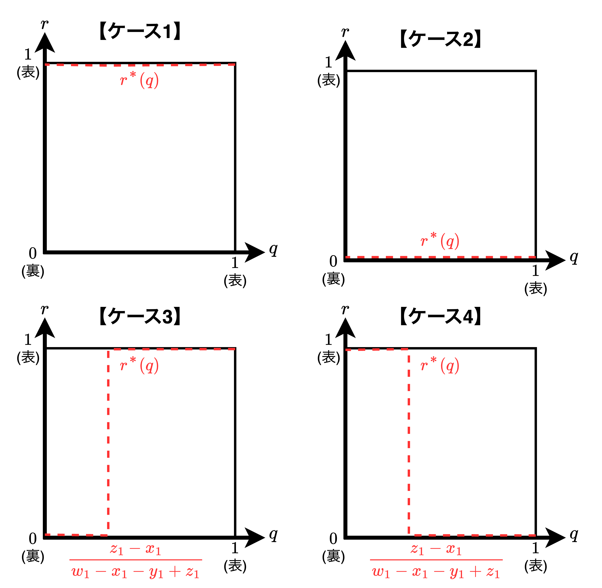
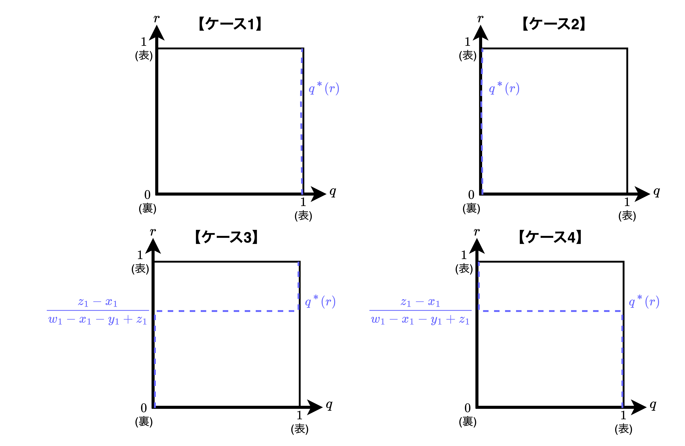

# 完備情報の静学ゲーム

- 本章では、各プレイヤーが同時に自身の行動を選び、その選ばれた行動の組合せに応じて各自の利得が決まる「**静学ゲーム（同時手番ゲーム、戦略型ゲーム）**」かつ、各プレイヤーの利得関数が全プレイヤーの共有知識となっている「**完全情報**」のゲームを対象とする。
- 1.1節では、ゲーム理論では以下の2つの基本問題を説明し、ゲームを分析するための理論の基礎を展開した後、「**ナッシュ均衡**」という広範なゲームに対して確かな予測を与えうる解概念を導入する。
  - 【**基本問題1**】ゲームをどのように定義するのかという問題
  - 【**基本問題2**】定義したゲームをどのように解くのかという問題
- 1.2節では1.1節で述べた手法の応用例を4つ紹介する。具体的には、クールノーの不完全競争モデル、ベルトランの不完全競争モデル、ファーバーの最終オファーによる調停のモデル、共有地問題、の4つである。
- 1.3節では、混合戦略ーこれは他のプレイヤーの行動に関する不確かさを表すものとして解釈されるーを定義し、そして、混合戦略をも許容したナッシュ均衡が存在すること（**ナッシュの定理**）を証明する。

## 【基礎理論】標準型ゲームとナッシュ均衡

### ゲームの標準型による表現〜ゲームをどのように定義するのか〜

> **標準型のゲーム**とは、各プレイヤーが同時に戦略を選択し、その組合せがそれぞれのプレイヤーの利得を決定する仕組みを意味する。

<table>
    <caption><b>囚人のジレンマ</b></caption>
	<tbody>
		<tr>
			<td colspan="2" rowspan="2"></td>
			<th colspan="2">囚人B</th>
		</tr>
		<tr>
			<td>黙秘</td>
			<td>自白</td>
		</tr>
		<tr>
			<th rowspan="2">囚人A</th>
			<td>黙秘</td>
			<td>-1,-1</td>
			<td>-9,0</td>
		</tr>
		<tr>
			<td>自白</td>
			<td>0,-9</td>
			<td>-6,-6</td>
		</tr>
	</tbody>
</table>

- 標準的なゲームを説明するために、典型的な例として**囚人のジレンマ**を考える。上表は2人の囚人が直面する状況を双行列として表現したものである。
  - 【囚人A黙秘、囚人B黙秘】→2人とも懲役1年
  - 【囚人A黙秘、囚人B自白】→囚人Aは懲役9年、囚人Bは釈放
  - 【囚人A自白、囚人B黙秘】→囚人Aは釈放、囚人Bは懲役9年
  - 【囚人A自白、囚人B自白】→2人とも懲役6年
- 囚人のジレンマにおける両プレイヤーの戦略は「自白・黙秘」の2つであり、ある特定の戦略の組が与えられた時の利得は双行列の升目の中に書き込まれている。通常は行プレイヤーの利得が書かれ、次に列プレイヤーの利得が書かれる。

#### 標準型ゲームの表現

> 【**定義：標準型ゲーム**】$n$人ゲームの標準型による表現とは各プレイヤーの戦略空間$S_1,\cdots ,S_n$および利得関数$u_1,\cdots ,u_n$を定めることであり、そのゲームは$G=\{S_1,\cdots ,S_n\hspace{1mm};\hspace{1mm}u_1,\cdots ,u_n\}$と表される。

- 標準型ゲームの表現は以下の3つを特定化する必要がある。
  1. ゲームのプレイヤー $i（1\leqq i\leqq n）$
  2. $i$ が選択できる戦略 $s_i$とその集合$S_i$（戦略空間と呼ぶ）
  3. 戦略の組合せ$(s_1,s_2,\dots,s_n)$における$i$の利得関数$u_i(s_1,s_2,\dots,s_n)$
- 標準型ゲームにおける重要な点として、「**他のプレイヤーの選択を知る前に自分の行動を選ぶ**」ということである。<u>囚人のジレンマを例にすると、囚人たちは独房に入っている間ならいつ自分の行動を決めても良いということである</u>。

### 強く支配される戦略の逐次消去〜定義したゲームをどのように解くのか〜

> 【**定義：強く支配される戦略**】
> 標準型ゲーム$G=\{S_1,\cdots ,S_n\hspace{1mm};\hspace{1mm}u_1,\cdots ,u_n\}$において、プレイヤー$i$の戦略$s_i'\in S_i、s_i''\in S_i$があり、他のプレイヤーがどのような戦略を選んだとしても常に以下を満たすとき、戦略$s_i''$は戦略$s_i'$によって**強く支配される**と言う。
> $$
> u_i(s_1,\cdots ,s_{i-1},s_i',s_{i+1},\cdots ,s_n)\ > \ u_i(s_1,\cdots ,s_{i-1},s_i'',s_{i+1},\cdots ,s_n)
> $$つまり、相手の戦略に依存せず自身の戦略のみに依存して常に良い結果をもたらす戦略のこと。

#### 囚人のジレンマでの説明

$$
u_{囚人A}(自白, 自白) = -6 > u_{囚人A}(黙秘, 自白) = -9\\[2mm]
u_{囚人A}(自白, 黙秘) = 0 > u_{囚人A}(黙秘, 黙秘) = -1\\[4mm]
\therefore\hspace{2mm}囚人Aの\bold{黙秘}は\bold{自白}によって強く支配される。（囚人Bについても同様）
$$

#### 抽象化ゲームでの説明

<table>
	<tbody>
		<tr>
			<td>
                <table>
                    <caption><b>抽象化ゲームの利得表①</b></caption>
                    <tbody>
                        <tr>
                            <td colspan="2" rowspan="2"></td>
                            <th colspan="3">プレイヤー2</th>
                        </tr>
                        <tr>
                            <td>L</td>
                            <td>M</td>
                            <td>R</td>
                        </tr>
                        <tr>
                            <th rowspan="2">プレイヤー1</th>
                            <td>U</td>
                            <td>1,0</td>
                            <td>1,2</td>
                            <td>0,1</td>
                        </tr>
                        <tr>
                            <td>D</td>
                            <td>0,3</td>
                            <td>0,1</td>
                            <td>2,0</td>
                        </tr>
                    </tbody>
                </table>
            </td>
			<td>
                <table>
                    <caption><b>抽象化ゲームの利得表②</b></caption>
                    <tbody>
                        <tr>
                            <td colspan="2" rowspan="2"></td>
                            <th colspan="3">プレイヤー2</th>
                        </tr>
                        <tr>
                            <td>L</td>
                            <td>M</td>
                        </tr>
                        <tr>
                            <th rowspan="2">プレイヤー1</th>
                            <td>U</td>
                            <td>1,0</td>
                            <td>1,2</td>
                        </tr>
                        <tr>
                            <td>D</td>
                            <td>0,3</td>
                            <td>0,1</td>
                        </tr>
                    </tbody>
                </table>
            </td>
		</tr>
        <tr>
			<td>
                <table>
                    <caption><b>抽象化ゲームの利得表③</b></caption>
                    <tbody>
                        <tr>
                            <td colspan="2" rowspan="2"></td>
                            <th colspan="3">プレイヤー2</th>
                        </tr>
                        <tr>
                            <td>L</td>
                            <td>M</td>
                        </tr>
                        <tr>
                            <th rowspan="2">プレイヤー1</th>
                            <td>U</td>
                            <td>1,0</td>
                            <td>1,2</td>
                        </tr>
                    </tbody>
                </table>
            </td>
			<td>
                <table>
                    <caption><b>抽象化ゲームの利得表④</b></caption>
                    <tbody>
                        <tr>
                            <td colspan="2" rowspan="2"></td>
                            <th colspan="2">プレイヤー2</th>
                        </tr>
                        <tr>
                            <td>M</td>
                        </tr>
                        <tr>
                            <th rowspan="2">プレイヤー1</th>
                            <td>U</td>
                            <td>1,2</td>
                        </tr>
                    </tbody>
                </table>
            </td>
        </tr>
	</tbody>
</table>

- 上表の①〜④は<b>強く支配される戦略の逐次消去</b>の過程を表す。具体的には以下の通り。
  1. 【**利得表①→②**】プレイヤー1について戦略UもDも強く支配されることはない。プレイヤー2について戦略RがMによって強く支配されている。この時、<u>プレイヤー1にプレイヤー2が合理的であることがわかっているならば</u>、戦略Rを削除することができ、利得表②が得られる。
  2. 【**利得表②→③**】プレイヤー1について戦略DがUによって強く支配されている。この時、<u>プレイヤー2にプレイヤー1が合理的であることがわかっており、さらにプレイヤー2に「プレイヤー1がプレイヤー2を合理的と考えている」ことがわかっているならば</u>、戦略Dを削除することができ、利得表③が得られる。
  3. 【**利得表③→④**】プレイヤー2について戦略LがMによって強く支配されている。このことから戦略の組は$(U,M)$に定まり、利得は$u(1,2)$に定まる。

#### 強く支配される戦略の逐次消去の2つの欠点

- 1つ目は、**各プレイヤーに共有知識があることを仮定しなくてはならないことである**。各プレイヤーが他のプレイヤーの合理性について知っていることをその都度仮定していかねばならず、仮定が無限に続いていく。
- 2つ目は、**この逐次削除がゲームの帰結についてしばしば極めて不正確な予測しか導き出さないということである**。例えば、どの戦略も逐次消去の過程で生き残ってしまう利得表が与えられた場合、なんら予測を下し得ない。（そこで、次にナッシュ均衡という考え方に目を向ける。）

### ナッシュ均衡の正当化と定義

> 【**定義：ナッシュ均衡**】
> $n$人の標準型ゲーム$G=\{S_1,\cdots ,S_n\hspace{1mm};\hspace{1mm}u_1,\cdots ,u_n\}$を考えた時、各プレイヤー$i$の戦略$s_i^*$が他の$(n-1)$人のプレイヤーの取る戦略の組$s_{-i}^*=(s_1^*,\cdots ,s_{i-1}^*,s_{i+1}^*,\cdots ,s_n^*)$への**最適反応**となっていることである。式で表すと以下の通り。$$
> u_i(s_1^*,\cdots ,s_i^*,\cdots ,s_n^*)\geqq u_i(s_1^*,\cdots ,s_i,\cdots ,s_n^*)
> \iff\hspace{1.5mm}\max_{s_i\in S_i}u_i(s_i,s_{-i}^*)=u_i(s_i^*,s_{-i}^*)
> $$ナッシュ均衡は「**戦略安定的**」または「**自己強制的**」であり、ナッシュ均衡により予測された戦略はプレイヤー自らが進んでその戦略を選んでいなければならない。そして、誰一人としてその予測された戦略から逸脱しようとはしない。

#### 強く支配される戦略とナッシュ均衡の関係

- 【**関係1**】強く支配される戦略の逐次消去で生き残る唯一の戦略は「一意的なナッシュ均衡」である。
- 【**関係2**】強く支配される戦略の逐次消去によって除れない戦略のうち、ナッシュ均衡にはならない戦略の組もある。
- 【**ナッシュ均衡の特徴**】ナッシュ均衡は複数ある場合もあれば、一意解を与え得ないゲーム（定石がないゲーム）もある。

#### ナッシュ均衡が複数ある場合〜男女の争い（両性の戦い）〜

<table>
    <caption><b>男女の争いの利得表</b></caption>
	<tbody>
		<tr>
			<td colspan="2" rowspan="2"></td>
			<th colspan="2">女性</th>
		</tr>
		<tr>
			<td>オペラ</td>
			<td>サッカー</td>
		</tr>
		<tr>
			<th rowspan="2">男性</th>
			<td>オペラ</td>
			<td><u>2</u>,<u>1</u></td>
			<td>0,0</td>
		</tr>
		<tr>
			<td>サッカー</td>
			<td>0,0</td>
			<td><u>1</u>,<u>2</u></td>
		</tr>
	</tbody>
</table>

- 上表は「男女の争い」というゲームの利得表である。このゲームには2つのナッシュ均衡が存在する。それは、$(オペラ,オペラ)$と$(サッカー,サッカー)$である。

## 【応用】

### クールノーの複占モデル

$$
\begin{align*}
&Q=q_1+q_2\hspace{1mm},\hspace{2mm}
P(Q)=\left\{
    \begin{array}{l}
        a-Q & (Q<a) \\
        0 & (Q\geqq a)
    \end{array}
\right.
\hspace{1mm},\hspace{2mm}
C_i(q_i)=cq_i
\end{align*}
\\[3mm]
\begin{align*}
    &Q: 総供給量\\
    &C_i: 企業iの総費用\\
    &c: 限界費用（0<c<a）\\
    &P: 価格\\
    &q_i: 企業iの生産量
\end{align*}
$$

- 本節では①非公式に述べられた問題の標準系ゲームへの変形、②ナッシュ均衡の導出、の2つを説明する。

#### ①標準型ゲームへの変形

- 【**プレイヤー**】企業$i=\{1,2\}$
- 【**戦略の集合（戦略空間）**】生産量の選択 $q_i（0\leqq q_i\leqq a）$
- 【**利得関数**】$\pi_i(q_i,q_j)=q_i[P(q_i+q_j)-c]=-q_i^2+(a-q_j-c)q_i$

#### ②ナッシュ均衡の導出

$$
\max_{0\leqq q_i<\infty}\hspace{1mm}\pi_i(q_i,q_j)\iff\pi_i'(q_i,q_j)=0\iff q_i=\frac{1}{2}(a-q_j-c)\\[3.5mm]
ここで、(i,j)=(1,2)、(2,1)を代入すると以下の連立方程式を得る。\\[2mm]
\left\{\begin{array}{l}
    \displaystyle{q_1^*=\frac{1}{2}(a-q_2^*-c)}\\[3mm]
    \displaystyle{q_2^*=\frac{1}{2}(a-q_1^*-c)}
\end{array}
\right.\iff
q_1^*=q_2^*=\frac{1}{3}(a-c)\\[2mm]
以上より、Q=\frac{2}{3}(a-c), \hspace{2mm}P(Q)=a-\frac{2}{3}(a-c)=\frac{a+2c}{3}, \hspace{2mm}\pi_1=\pi_2=\frac{1}{9}(a-c)^2
$$

### ベルトランの複占モデル

$$
\begin{align*}
&q_i(p_i,p_j)=a-p_i+bp_j
\end{align*}
\\[3mm]
\begin{align*}
    &b: 企業iの販売価格に対する需要の弾力性（0<b<2）\\
    &p_i: 企業iの販売価格\\
    &q_i: 企業iの生産量
\end{align*}
$$

- 本節では①非公式に述べられた問題の標準系ゲームへの変形、②ナッシュ均衡の導出、の2つを説明する。
- 以下、$c$を限界費用とする$(0<c<a)$。

#### ①標準型ゲームへの変形

- 【**プレイヤー**】企業$i=\{1,2\}$
- 【**戦略の集合（戦略空間）**】価格の選択 $p_i（0\leqq p_i\leqq a）$
- 【**利得関数**】$\pi_i(p_i,p_j)=q_i(p_i,p_j)(p_i-c)=(a-p_i+bp_j)(p_i-c)$

#### ②ナッシュ均衡の導出

$$
\max_{0\leqq p_i<\infty}\hspace{1mm}\pi_i(p_i,p_j)\iff\pi_i'(p_i,p_j)=0\iff p_i=\frac{1}{2}(a+bp_j+c)\\[3.5mm]
ここで、(i,j)=(1,2)、(2,1)を代入すると以下の連立方程式を得る。\\[2mm]
\left\{\begin{array}{l}
    \displaystyle{p_1^*=\frac{1}{2}(a+bp_2^*+c)}\\[3mm]
    \displaystyle{p_2^*=\frac{1}{2}(a+bp_1^*+c)}
\end{array}
\right.\iff
p_1^*=p_2^*=\frac{a+c}{2-b}\\[2mm]
以上より、q_1(p_1^*,p_2^*)=q_2(p_2^*,p_1^*)=\frac{a+(b-1)c}{2-b}\\[2mm]
$$

### 最終オファーによる調停

$$
w_uが選ばれる確率=F\left(\frac{w_f+w_u}{2}\right)\hspace{5mm}
w_fが選ばれる確率=1-F\left(\frac{w_f+w_u}{2}\right)\\[4mm]
\begin{align*}
    &F(x): 分布関数、F'(x)=f(x): 確率密度関数\\
    &w_u: 労働組合の要求水準、w_f: 企業側の提示水準
\end{align*}
$$

- 公務員の多くはストライキを禁止されているが、その代わりに賃金争議は拘束力のある調停によって解決される。医療ミスの訴訟、株主の株式仲介人への賠償請求など、他の争議の多くも、同様に調停の手を借りる。このような調停には「**慣習的**」なものと「**最終オファー**」によるものと2つがある。
  - 【**慣習的な調停**】仲裁者が調停案としてどんな賃金でも選べることである
  - 【**最終オファーによる調停**】当事者双方がそれぞれ賃金の金額をオファーし、仲裁者がそのうちの一つを選んで調停案とするものである。

#### ①標準型ゲームへの変形

$$
期待値P(w_u,w_f)=w_u\cdot F\left(\frac{w_f+w_u}{2}\right)+w_f\cdot\left(1-F\left(\frac{w_f+w_u}{2}\right)\right)
$$

- 【**プレイヤー**】労働組合 $u$、企業 $f$
- 【**戦略の集合（戦略空間）**】オファー額 $w_u,w_f$
- 【**利得関数**】賃金調停案の期待値 $P(w_u,w_f)$

#### ②ナッシュ均衡の導出

$$
\max_{w_u}\hspace{1mm}P(w_u^*,w_f)\hspace{2mm}かつ\hspace{2mm}\min_{w_f}\hspace{1mm}P(w_u,w_f^*)\iff\frac{\delta P}{\delta w_u^*}=\frac{\delta P}{\delta w_f^*}=0\\[2mm]
これを解くと以下のようになる\\[4mm]
\begin{align*}
    &\left\{
    \begin{array}{l}
        \displaystyle\frac{\delta P}{\delta w_u^*}=F\left(\frac{w_f^*+w_u^*}{2}\right)+\frac{w_u^*-w_f^*}{2}f\left(\frac{w_f^*+w_u^*}{2}\right)=0\\[5mm]
        \displaystyle\frac{\delta P}{\delta w_f^*}=1-F\left(\frac{w_f^*+w_u^*}{2}\right)+\frac{w_u^*-w_f^*}{2}f\left(\frac{w_f^*+w_u^*}{2}\right)=0
    \end{array}
    \right.\\[4mm]
    &\iff
    \left\{
    \begin{array}{l}
        【結果1】\displaystyle F\left(\frac{w_f^*+w_u^*}{2}\right)=\frac{1}{2}\\[5mm]
        【結果2】\displaystyle w_u^*-w_f^*=\frac{1}{f\left(\frac{w_f^*+w_u^*}{2}\right)}
    \end{array}
    \right.
\end{align*}
$$

- 【**結果1**】オファー額の平均が仲裁者の案のメジアン（中央値）に等しい
- 【**結果2**】二つのオファー額の差は仲裁者案の密度関数のメジアンでの値の逆数に等しい

$$
f\left(x\right)=\frac{1}{\sqrt{2\pi}\sigma}\exp\left(-\frac{(x-\mu)^2}{2\sigma^2}\right)とすると、結果1、2から以下の連立方程式を得る\\[3mm]
\left\{
    \begin{array}{l}
        \displaystyle\frac{w_u^*+w_f^*}{2}=m\\[3mm]
        \displaystyle w_u^*-w_f^*=\sqrt{2\pi\sigma^2}
    \end{array}
\right.
\iff
\left\{
    \begin{array}{l}
        \displaystyle w_u^*=m+\sqrt{\frac{\pi\sigma^2}{2}}\\[3.5mm]
        \displaystyle w_f^*=m-\sqrt{\frac{\pi\sigma^2}{2}}
    \end{array}
\right.
$$

- 不確実性が高い（$\sigma$が大きい）ほど、労働組合はより高い賃金を要求し、企業はより低い賃金を提示する。
- 不確実性が低い（$\sigma$が小さい）、つまり仲裁者の案がかなりの確率ではっきりしている場合ほど、平均よりかけ離れたオファーをしない方が良い。
 

### 共有地問題

$$
\begin{align*}
    &v(G):\text{農民が受ける山羊1頭あたりの利益}\\
    &G=\sum_{i=1}^n g_i: \text{山羊の総数}（G<G_{max}）
\end{align*}\\[3mm]
\begin{align*}
    &i: \text{農民}（1\leqq i\leqq n）\\
    &g_i: \text{農民 }i\text{ の山羊の数}\\
    &G_{max}: 共有緑地で飼育可能な山羊の最大数
\end{align*}
$$

- 共有資源をテーマにしてナッシュ均衡を求める。

#### ①標準型ゲームへの変形

- 【**プレイヤー**】農民 $i（1\leqq i\leqq n）$
- 【**戦略の集合（戦略空間）**】山羊の数 $g_i$
- 【**利得関数**】$G(v(G)-c)$　　※ $v(x)$ は農民が受ける山羊1頭あたりの利益、$c$ は山羊1頭を飼育するコスト

#### ②ナッシュ均衡の導出

$$
\begin{align*}
    \max_{0\leqq G<\infty}\hspace{1mm}G(v(G)-c)
    &\iff v(G^*)+G^*v'(G^*)-c=0
\end{align*}\\[2mm]
ここで、v(x)>c>0より、\color{red}v'(x)<0\color{black}である。
$$

- 【**結論**】山羊を1匹追加するたびに、$v'(x)$だけの損害（全体では$Gv'(x)$の損害）が及ぶ。つまり、「**公共財が使われすぎる**」ということになる。

## 【より上級の理論】混合戦略と均衡の存在

### 混合戦略

#### 純粋戦略におけるナッシュ均衡がないゲーム

<table>
    <caption><b>ペニー合わせ</b></caption>
	<tbody>
		<tr>
			<td colspan="2" rowspan="2"></td>
			<th colspan="2">プレイヤー2</th>
		</tr>
		<tr>
			<td>表</td>
			<td>裏</td>
		</tr>
		<tr>
			<th rowspan="2">プレイヤー1</th>
			<td>表</td>
			<td>-1,1</td>
			<td>1,-1</td>
		</tr>
		<tr>
			<td>裏</td>
			<td>1,-1</td>
			<td>-1,1</td>
		</tr>
	</tbody>
</table>

- 【**ナッシュ均衡がないゲーム例**】ペニー合わせゲーム
  - 【コインの結果が同じ】→プレイヤー1が1ドル得る、プレイヤー2が1ドル失う
  - 【コインの結果が異なる】→プレイヤー1が1ドル失う、プレイヤー2が1ドル得る
- 上記のゲームでは2人の戦略が一致した時〜(表,表)、(裏,裏)〜はプレイヤー1は戦略を変えたいと思い、異なった時〜(表,裏)、(裏,表)〜はプレイヤー2は戦略を変えたいと思う。つまり、このゲームには純粋戦略におけるナッシュ均衡がない。
- このことから、純粋戦略においてどんなゲームを考えるにしてもそこに相手を出し抜く要素がある（不確実性がある）場合にはナッシュ均衡はあり得ない。この不確実性を「確率分布」として解釈することで、混合戦略という概念が生まれる。

#### 混合戦略の定義

> 【**定義：混合戦略**】
> $n$人の標準型ゲーム$G=\{S_1,\cdots ,S_n\hspace{1mm};\hspace{1mm}u_1,\cdots ,u_n\}$を考え、プレイヤー$i$は$K$個の戦略$S_i=\{s_{i1},\cdots ,s_{iK}\}$を持っているとする。この時のプレイヤー$i$の**混合戦略**とは確率分布$p_i=(p_{i1},\cdots ,p_{iK})$のことで、$\sum_{k=1}^K p_{ik}=1$、$0\leqq p_{ik}\leqq 1$を満たす。

### ナッシュ均衡の存在

#### ペニー合わせでの利得期待値

$$
\begin{align*}
期待利得&=rq\cdot(-1)+r(1-q)\cdot 1+(1-r)q\cdot 1+(1-r)(1-q)\cdot(-1)\\
&=(2q-1)+2r(1-2q)
\end{align*}\\[2mm]
ここで、2r(1-2q)について、1-2q>0の時はrは増加的、逆は減少的である。\\[2mm]
\therefore\color{red}q<\frac{1}{2}の時はr^*\left(q<\frac{1}{2}\right)=1、q>\frac{1}{2}の時はr^*\left(q>\frac{1}{2}\right)=0が最適反応となる。
$$

#### 混合戦略に対する最適反応

$$
v_{\color{red}1}(p_1,p_2)=\sum_{j=1}^J\sum_{k=1}^K p_{1j}p_{2k}u_{\color{red}1}(s_{1j},s_{2k})
,\hspace{1mm}
v_{\color{blue}2}(p_1,p_2)=\sum_{j=1}^J\sum_{k=1}^K p_{1j}p_{2k}u_{\color{blue}2}(s_{1j},s_{2k})
\\[3mm]
\begin{align*}
    &v_i: 期待利得,\hspace{1mm}p_i: プレイヤーiの混合戦略\\
    &u_i: プレイヤーiの利得関数,\hspace{1mm}s_{ij}: プレイヤーiのj番目の純粋戦略
\end{align*}
$$

> 【**定義：混合戦略に対する最適反応**】
> 2人プレイヤーの標準型ゲーム$G=\{S_1,S_2\hspace{1mm};\hspace{1mm}u_1,u_2\}$において、混合戦略$(p_1^*,p_2^*)$がナッシュ均衡であるとは、各プレイヤーの混合戦略が他プレイヤーの混合戦略に対する最適反応となっていること、つまり、$v_1(p_1^*,p_2^*)\geqslant v_1(p_1,p_2^*)$と$v_2(p_1^*,p_2^*)\geqq v_2(p_1^*,p_2)$が成立することである。ここで、$v_1(p_1^*,p_2^*)$と$v_2(p_1^*,p_2^*)$は以下の式で表す。
> $$
> \begin{align*}
> v_1(p_1^*,p_2^*)&=\sum_{p_{1i}\in P_1}\sum_{p_{2j}\in P_2}p_{1i}^*p_{2j}^*u_{1}(s_{1i},s_{2j})\\[3mm]
> v_2(p_1^*,p_2^*)&=\sum_{p_{1i}\in P_1}\sum_{p_{2j}\in P_2}p_{1i}^*p_{2j}^*u_{2}(s_{1i},s_{2j})
> \end{align*}
> $$

##### 両性の戦いでの混合戦略の確認

<table>
    <caption><b>【再掲】男女の争いの利得表</b></caption>
	<tbody>
		<tr>
			<td colspan="2" rowspan="2"></td>
			<th colspan="2">女性</th>
		</tr>
		<tr>
			<td>オペラ</td>
			<td>サッカー</td>
		</tr>
		<tr>
			<th rowspan="2">男性</th>
			<td>オペラ</td>
			<td><u>2</u>,<u>1</u></td>
			<td>0,0</td>
		</tr>
		<tr>
			<td>サッカー</td>
			<td>0,0</td>
			<td><u>1</u>,<u>2</u></td>
		</tr>
	</tbody>
</table>

$$
\begin{align*}
    男性の期待利得\hspace{1mm}r(q)&=rq\cdot 2+(1-r)(1-q)\cdot 1=-q+1+r(3q-1)
\end{align*}\\[1mm]
\therefore\color{red}\hspace{2mm}r^*(q)\color{black}=\left\{
\begin{array}{l}
    0&（q<1/3）\\[1mm]
    \text{任意(全区間)}&（q=1/3）\\[1mm]
    1&（q>1/3）
\end{array}
\right.
\\[3mm]
\begin{align*}
    女性の期待利得\hspace{1mm}q(r)&=rq\cdot 1+(1-r)(1-q)\cdot 2=q(3r-2)-2(r-1)
\end{align*}\\[1mm]
\therefore\color{blue}\hspace{2mm}q^*(r)\color{black}=\left\{
\begin{array}{l}
    1&（r<2/3）\\[1mm]
    \text{任意(全区間)}&（r=2/3）\\[1mm]
    0&（r>2/3）
\end{array}
\right.
$$

- ナッシュ均衡はプレイヤーの最適反応対応の交点の数だけ存在する。例えば、両性の戦いでは3つの交点があることから3つのナッシュ均衡が存在する。

#### プレイヤー2人での混合戦略を含むナッシュ均衡の存在

<table>
	<tbody>
		<tr>
			<th>プレイヤー1の最適反応</th>
			<th>　　　プレイヤー2の最適反応　　　　　</th>
		</tr>
		<tr>
			<td></td>
			<td></td>
		</tr>
	</tbody>
</table>

| プレイヤー1＼プレイヤー2 |     表     |     裏     |
| :----------------------: | :--------: | :--------: |
|          **表**          | $w_1, w_2$ | $x_1, x_2$ |
|          **裏**          | $y_1, y_2$ | $z_1, z_2$ |

$$
\begin{align*}
    r(q)&=rqw_1+r(1-q)x_1+(1-r)qy_1+(1-r)(1-q)z_1\\
    &=r(q(w_1-x_1-y_1+z_1)+x_1-z_1)+qy_1+z_1(1-q)
\end{align*}\\[1mm]
\therefore\color{red}\hspace{2mm}r^*(q)\color{black}=\left\{
\begin{array}{l}
    0& \left(q<\displaystyle\frac{z_1-x_1}{w_1-x_1-y_1+z_1}=q'\right)\\[4mm]
    \text{任意(全区間)}& \left(q=q'\right)\\[1mm]
    1& \left(q>q'\right)
\end{array}\right.\\[5mm]
\begin{align*}
    q(r)&=rqw_2+r(1-q)x_2+(1-r)qy_2+(1-r)(1-q)z_2\\
    &=q(r(w_2-x_2-y_2+z_2)+x_2-z_2)+ry_2+z_2(1-r)
\end{align*}\\[1mm]
\therefore\color{blue}\hspace{2mm}q^*(r)\color{black}=\left\{
\begin{array}{l}
    0& \left(r<\displaystyle\frac{z_2-x_2}{w_2-x_2-y_2+z_2}=r'\right)\\[4mm]
    \text{任意(全区間)}& \left(r=r'\right)\\[1mm]
    1& \left(r>r'\right)
\end{array}\right.
$$

- プレイヤー1と2の混合戦略をそれぞれ$(r,1-r)$、$(q,1-q)$とすると、期待利得$r(q)$と$q(r)$は上式のようになる。

#### 【ナッシュの定理】混合戦略を含む一般的なゲームにおけるナッシュ均衡の存在についての考察

> 【**ナッシュの定理**】
> $n$人の標準ゲーム$G=\{S_1,\cdots ,S_n\hspace{1mm};\hspace{1mm}u_1,\cdots ,u_n\}$において、$n$が有限で、どの$i$についても$S_i$が有限集合であるならば、混合戦略までをも含みうるナッシュ均衡が少なくとも1つは必ず存在する。

- ナッシュ均衡の可能性としては以下の3パターンが考えられる。囚人のジレンマはパターン1、ペニー合わせはパターン2、両性の戦いはパターン3に当てはまる。
  - 【**パターン1**】純粋戦略のナッシュ均衡が1つ
  - 【**パターン2**】混合戦略のナッシュ均衡が1つ
  - 【**パターン3**】純粋戦略のナッシュ均衡が2つ、混合戦略のナッシュ均衡が1つ
- ナッシュの定例の証明には**不動点定理**が用いられる。具体的には①ある種の対応の不動点（$n$人のプレイヤーの最適反応対応）がどれもナッシュ均衡であることを示し、②適当な不動点定理（角谷の不動点定理）を用いてその対応に不動点のあることを示す、という2ステップが必要である。

