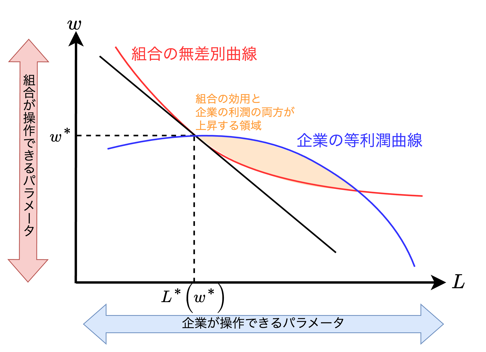
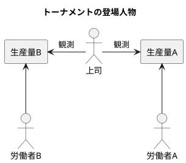
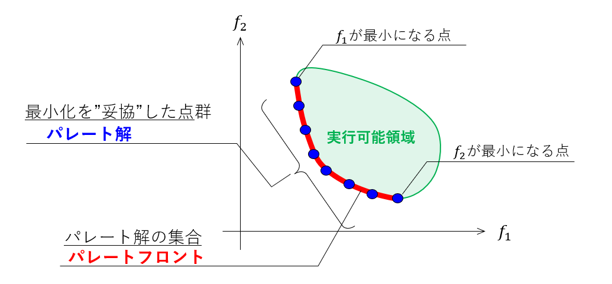

<div class="chap2">

# 完備情報の動学ゲーム

- 本章では動学ゲームを導入する。ここでも完備情報ゲーム（<font color=red>プレイヤーの利得関数が共有知識であるようなゲーム</font>）を対象とする。また、2.1節では完備完全情報の動学ゲーム、2.2〜2.4節では完備不完全情報の動学ゲームを扱う。
  - 【**完全情報**】自分の手番になった時、<font color=red>それまでのゲームの歴史（展開）を<b>知っている</b>。</font>
  - 【**不完全情報**】自分の手番になった時、<font color=red>それまでのゲームの歴史（展開）を<b>知らない</b>。</font>
- 2.1節では、プレイヤー1が手番を選び、次にプレイヤー2がその選択を見た後で自分の手番を選んでゲームが終わるという、完備完全情報の動学ゲームを扱う。具体的には**後ろ向き帰納法による結果を定義**し、ナッシュ均衡との関係を述べる。また本節では以下のモデルを紹介する。
  - シュタッケルベルクの複占モデル
  - レオンティエフのモデル
  - ルービンシュタインの交渉モデル（手番の列が無限になりうるため完備完全情報ゲームには属さない）
- 2.2節では、2.1節で分析したゲームのクラスを拡張して次のゲームを考える。プレイヤー1と2が同時に手番を選び、次にプレイヤー3と4が彼らの手番を選択を知った上で自分たちの手番を選んでゲームが終わる。この同時手番ということが不完全情報を意味し、**サブゲーム完全な結果（後ろ向き帰納法の自然な拡張）を定義する**。また、本節では以下のモデルを紹介する。
  - ダイアモンド=大ビッグの銀行取付モデル
  - 関税と不完全国際競争のモデル
  - ラジアー=ローゼンのトーナメントモデル
- 2.3節では**繰り返しゲーム**を取り上げる。これは一定のプレイヤーが所与のゲームを繰り返しを行い、次のゲームが始まる前に以前のゲームの結果が全てのプレイヤーにわかっているようなゲームである。このゲームを分析するために**サブゲーム完全なナッシュ均衡を定義する**。その後、無限繰り返しゲームについてフォーク定理を述べて証明し、以下のモデルを分析する。
  - フリードマンのクールノー型複占企業共謀モデル
  - シャピロ=スティグリッツの効率賃金モデル
  - バロー=ゴードンの金融政策モデル
- 2.4節では完全情報、不完全情報のいずれであるかを問わず、一般の完備情報の動学ゲームを分析するのに必要な用具を説明する。まず**ゲームの展開型による表現を定義**し、第1章の標準型（戦略型）による表現とのつながりを考える。次に**一般のゲームでサブゲーム完全なナッシュ均衡を定義する**。<u>本節の主要な論点は、完備情報の動学ゲームは多数のナッシュ均衡を持つ可能性があるが、そのうちのいくつかには信憑性を欠く脅しや約束が含まれているかもしれないということであり、<font color=red>サブゲーム完全なナッシュ均衡はある種の信憑性の基準に合格する均衡である</font></u>。

<div style="page-break-before:always"></div>

## 完備完全情報の動学ゲーム

### 【理論】後ろ向き帰納法

$$
\max_{a_1\in A_1}\hspace{1mm}u_1(a_1,R_2(a_1))\\[4mm]
\begin{align*}
    &a_1: \text{プレイヤー1の行動}\\
    &R_2(a_1): a_1\text{に対するプレイヤー2の最適反応}    
\end{align*}
$$

- 手榴弾ゲームは次の簡単な完備完全情報ゲームのクラスに属する
  1. プレイヤー1が実行可能な行動の集合$A_1$から行動$a_1$を選ぶ
  2. プレイヤー2は$a_1$を見た上で実行可能な行動の集合$A_2$から行動$a_2$を選ぶ
  3. それぞれの利得$u_1(a_1,a_2)$、$u_2(a_1,a_2)$が決まる
- 完備完全情報の動学ゲームの主要な特徴は以下の三つ
  1. 手番が逐次的に回ってくること
  2. 次の手番の前にそれまでの手番がどういう行動が選ばれたかが皆わかっていること
  3. 実行可能な行動の組合せで決まる各プレイヤーの利得が共有知識であること
- <font color=red>上式の$(a_1,R_2(a_1))$を<b>後ろ向き帰納法による結果</b></font>と定義する。

<div style="page-break-before:always"></div>

#### 後ろ向き帰納法の議論に内在する合理性の仮定

```plantuml
title 後ろ向き帰納法の議論に内在する合理性の仮定
left to right direction

rectangle "【**第1段階**】\nプレイヤー1" as select1
rectangle "【**終了**】\n2\n0" as payoff1
rectangle "【**終了**】\n1\n1" as payoff2
rectangle "【**終了**】\n3\n0" as payoff3
rectangle "【**終了**】\n0\n2" as payoff4
rectangle "【**第2段階**】\nプレイヤー2" as select2
rectangle "【**第3段階**】\nプレイヤー1" as select3

select1 --> payoff1: L
select1 --> select2: R
select2 --> payoff2: L'
select2 --> select3: R'
select3 --> payoff3: L''
select3 --> payoff4: R''
```

- 上図のように3番手ゲームを考える
  1. プレイヤー1は$L$または$R$を選ぶ。それが$L$ならばゲームは終わり、プレイヤー1の利得が2、プレイヤー2の利得が0となる
  2. プレイヤー2はプレイヤー1の選択を見て、もしそれが$R$なら$L'$または$R'$を選ぶ。$L'$ならばゲームは終わり、両者とも1の利得を得る。
  3. プレイヤー1はプレイヤー2の選択を見て、（また第1段階も念頭において）もしそれらが$R,R'$ならば$L''$または$R''$を選ぶ。どちらの場合でもゲームは終わり、$L''$ならプレイヤー1は3、プレイヤー2は0の利得を得る。$R''$ならプレイヤー1は0、プレイヤー2は2の利得を得る。
- 【**推論**】上記を踏まえ、**後ろ向き機能法による結果**の計算は以下のとおり。
  1. 第3段階より、プレイヤー1は$L''$から得られる利得3と$R''$から得られる利得0の選択に当面するので<b>$L''$が最適となる</b>。
  2. 第2段階より、プレイヤー2はもしゲームが第3段階に達したならプレイヤー1は$L''$を選び、プレイヤー2の利得は0になるであろうと予想する。よって第2段階でのプレイヤー2の選択は$L'$から得られる利得1と$R'$から得られる利得0から<b>$L'$が最適となる</b>。
  3. i., ii.より、第1段階でプレイヤー1はもしゲームが第2段階に達したならプレイヤー2は$L'$を選びプレイヤー1の利得は1になるであろうと予想する。よって第一段階でのプレイヤー1の選択は$L$から得られる利得2と$R$から得られる利得1から<b>$L$が最適となる</b>。
- 推論の結果から、プレイヤー1が$L$を選択することが<b>後ろ向き帰納法による結果</b>である。ただ<u>推論の重要な部分は「もし第一段階でゲームが終わらなかったら何が起こるのか」ということにかかっている</u>。つまり、<font color=red>プレイヤー1またはプレイヤー2が合理的であることが共有知識でなければ、後ろ向き帰納法による結果は予測を与えない</font>。

<div style="page-break-before:always"></div>

### シュタッケルベルクの複占モデル

$$
\begin{align*}
    &利潤関数\quad\pi_i(q_i,q_j)=q_i(P(Q)-c)=q_i[a-(q_i+q_j)-c]\\
    &総生産量\quad Q=q_1+q_2    
\end{align*}
$$

- 本節のモデルはクールノーモデルと同様、生産量$q$を選ぶという仮定のもとでモデル構成をする。
- 【**手順**】
  1. 企業1が生産量$q_1\geqq 0$を決定する
  2. 企業2は企業1の生産量$q_1$を見た上で生産量$q_2\geqq 0$を決定する
  3. 企業$i$の利得が利潤関数$\pi_i(q_i,q_j)$によって与えられる

#### 後ろ向き帰納法による結果

$$
q_2=R(q_1)とすると、1.2.A節より\quad R(q_1)=\frac{a-q_1-c}{2}\\[2mm]
\max_{q_1\geqq 0}\hspace{1.5mm}\pi_1(q_1,R(q_1))\iff\frac{\delta\pi_1(q_1,R(q_1))}{\delta q_1}=0\iff\underline{q_1=\frac{a-c}{2}}\\[3mm]
\therefore\underline{R(q_1)=\frac{a-c}{4}} \\[4mm]
以上より、Q=q_1+q_2=\frac{3}{4}(a-c), \hspace{2mm}P(Q)=\frac{1}{4}(a+3c)\\[3mm]
\pi_1=\frac{1}{8}(a-c)^2, \hspace{2mm}\pi_2=\frac{1}{16}(a-c)^2
$$

|                | ①シュタッケルベルク   | ②クールノー          | 差分$（①-②）$             |
| -------------- | --------------------- | -------------------- | ------------------------- |
| 総生産量$Q$    | $\frac{3}{4}(a-c)$    | $\frac{2}{3}(a-c)$   | $\frac{1}{12}(a-c)>0$     |
| 均衡価格$P(Q)$ | $\frac{1}{4}(a+3c)$   | $\frac{1}{3}(a+2c)$  | $-\frac{1}{12}(a-c)<0$    |
| $\pi_1$        | $\frac{1}{8}(a-c)^2$  | $\frac{1}{9}(a-c)^2$ | $\frac{1}{72}(a-c)^2>0$   |
| $\pi_2$        | $\frac{1}{16}(a-c)^2$ | $\frac{1}{9}(a-c)^2$ | $-\frac{7}{144}(a-c)^2<0$ |

- 【**結論**】<font color=red>ゲーム理論ではより多くの情報を持っていると他のプレイヤーに知られることがプレイヤーを不利にしうる</font>。

### 組合を持つ企業における賃金と雇用

$$
\begin{align*}
    &組合の効用関数\quad U(w,L)\\
    &企業の利潤関数\quad \pi(w,L)=R(L)-wL
\end{align*}\\[1mm]
\begin{align*}
    w&：組合が企業に要求する賃金\\
    R(L)&：L人の労働者を雇った時の収入\\
    &※R(L)は増加かつ凹関数、例えば\log xや\sqrt{x}など
\end{align*}
$$

- 本節のモデルは企業と独占組合をモデル化したレオンティエフのモデルを紹介する。ここで、$U(w,L)$は$w$と$L$の両方について増加関数であると仮定する。
- 【**手順**】
  1. 組合が賃金要求$w$を出す
  2. 企業が$w$を知って（かつそれを受けて）雇用量$L$を選ぶ
  3. 利得が$U(w,L)$と$\pi(w,L)$で与えられる

#### 後ろ向き帰納法による結果

##### 【第2段階】企業の最適反応


$$
\max_{L\geqq 0}\hspace{1mm}\pi(w,L)\iff\frac{\delta\pi(w,L)}{\delta L}=0\iff R'(L)=w
$$

- 上式より$R'(L)=w$を満たす$L^*(w)$が企業の最適反応となる。これは$R(L)$における接戦の傾きが$w$となるような解が存在することと同値である。
- ここで$R(L)$が増加かつ凹関数であることから、$R'(0)=\infty ,\hspace{1mm}R'(\infty)=0$である。

##### 【第1段階】組合の最適反応



$$
\max_{w\ge 0}\hspace{1mm}U(w,L^*(w))
$$

- 上図より、組合の無差別曲線上にくるように賃金要求$(w^*,L^*(w^*))$を選ぶ。
- 組合は賃金$w$を操作でき、企業は雇用量$L$を操作できる。つまり、上図の赤線と青線で囲まれた領域が組合と企業の両方にメリットのある領域である。

<div style="page-break-before:always"></div>

### 逐次的交渉

#### 3期間の交渉モデル

```plantuml
title 後ろ向き帰納法の議論に内在する合理性の仮定
left to right direction

rectangle 第1期 {
    rectangle "【**1a**】\nプレイヤー1" as select1
    rectangle "【**1b**】\nプレイヤー2" as select2
    rectangle "【**終了**】\ns1\n1-s1" as payoff1
}
rectangle 第2期 {
    rectangle "【**2a**】\nプレイヤー2" as select3
    rectangle "【**2b**】\nプレイヤー1" as select4
    rectangle "【**終了**】\ns2\n1-s2" as payoff2
}
rectangle 第3期 {
    rectangle "【**3**】\nプレイヤー1" as select5
    rectangle "【**終了**】\ns\n1-s" as payoff3
}

select5 <- select4: <color red>拒否</color>
select1 --> select2: 案出し
select2 --> payoff1: <color blue>受諾</color>
select3 <- select2: <color red>拒否</color>
select3 --> select4: 案出し
select4 --> payoff2: <color blue>受諾</color>
select5 --> payoff3
```

- 3期間の交渉モデルの手順は以下の通り。
  1. 【**1a**】第1期の機種にプレイヤー1は自分の1ドルのうち$s_1(0\leqq s_1\leqq 1)$だけを取り、プレイヤー2に$1-s_1$を残すという案を出す
  2. 【**1b**】プレイヤー2は受諾するか（その場合はゲーム終了、プレイヤー1は利得$s_1$を、プレイヤー2は利得$1-s_1$を直ちに受け取る）、拒否する（ゲームは第2期に続く）。
  3. 【**2a**】第2期の期首にプレイヤー2はプレイヤー1が1ドルのうち$s_2(0\leqq s_2\leqq 1)$だけを取り、プレイヤー2は$1-s_2$を取るという案を出す（ここでの記法はどちらが提案する場合も$s_5$が常にプレイヤー1の取り分を表すようになっていることに注意）。
  4. 【**2b**】プレイヤー1は受諾するか（その場合ゲームは終わり、プレイヤー1は利得$s_2$を、プレイヤー2は利得$1-s_2$を直ちに受け取る）、その案を拒否する（ゲームは第3期に続く）。
  5. 【**3**】第3期首にプレイヤー1は1ドルのうち$s(0\leqq s\leqq 1)$を受け取り、プレイヤー2は$1-s$を受け取る。
  
##### 後ろ向き帰納法による結果

$$
s_2=\delta s,\hspace{2mm}s_1=1-\delta(1-s_2)=1-\delta(1-\delta s)\\[2mm]
割引因子\quad\delta=\frac{1}{1+r}\hspace{7mm}※\hspace{.5mm}r：1期あたりの利子率
$$

- 後ろ向き帰納法により、まず第2期に達した場合、プレイヤー1は$s_2\leqq\delta s$を満たすなら「<font color=blue>受諾</font>」、そうでなければ「<font color=red>拒否</font>」する。以上のことから<b>プレイヤー2の最適な提案は$s_2^*=\delta s$である</b>。
- 次に第1期に達した場合、プレイヤー2は$1-s_1\geqq\delta(1-s_2)$つまり$s_1\leqq1-\delta(1-s_2)$を満たすなら「<font color=blue>受諾</font>」、そうでなければ「<font color=red>拒否</font>」する。以上のことから<b>プレイヤー1の最適な提案は$s_1^*=1-\delta(1-s_2^*)=1-\delta(1-\delta s)$である</b>。
- 以上の結果から、3期間の交渉モデルの後ろ向き機能法の結果は、プレイヤー1が分割案$(s_1^*,1-s_1^*)$をプレイヤー2に提案して、プレイヤー2がそれを受諾するというものである。

#### ルービンシュタインモデル（無限回の交渉モデル）

- 3期間の交渉モデルを無限回に拡張する。つまり、(3a), (3b), (4a), (4b), ...と限りなく期が続いていくモデルを考える。

##### 後ろ向き帰納法による結果

- 後ろ向き帰納法において、まず<font color=red>プレイヤー1は第1期に案$(f(s),1-f(s))$を出し、プレイヤー2は諾否を行う</font>。ここで、全体ゲームの後ろ向き帰納法の結果でプレイヤー1で得ることのできる最大利得と最小利得をそれぞれ$s_H$、$s_L$とする。
- 3期間の交渉ゲームにおいては $f(s)=1-\delta +\delta^2 s$ であり、$f(s)=s$を解くと $s=\displaystyle{\frac{1}{1+\delta}}$ となる。$s_H=s_L=s^*$と言え、結局全体ゲームの後ろ向き帰納法による結果が一意的に存在することになる。つまり、<font color=red>プレイヤー1が第1期に$(s^*,1-s^*)$をプレイヤー2に提案し、プレイヤー2がそれを受諾することが最適な提案となる</font>。

<div style="page-break-before:always"></div>

## 完備不完全情報の2段階ゲーム

### 【理論】サブゲーム完全性

> **定義：サブゲーム完全な結果**
> 以下の手順で$(a_1^*,a_2^*)$が同時手番ゲームの一意的なナッシュ均衡であった時、行動$(a_1^*,a_2^*,a_3^*(a_1^*,a_2^*),a_4^*(a_1^*,a_2^*))$を2段階ゲームのサブゲーム完全な結果と呼ぶ。
> 1. プレイヤー1と2がそれぞれの実行可能な行動の集合 $A_1,A_2$ から行動 $a_1,a_2$ を同時に選ぶ。
> 2. 利得が $u_i(a_1,a_2,a_3^*(a_1,a_2),a_4^*(a_1,a_2))$ $, i=1,2$ で与えられる。

- <font color=red>本節では、以下の完備不完全情報の2段階ゲームを考察する</font>。
  1. プレイヤー1と2が同時に行動 $a_1,a_2$ をそれぞれの実行可能集合 $A_1,A_2$ から選ぶ。
  2. プレイヤー3と4が第1段階の結果 $(a_1, a_2)$ を観察し、その後同時に行動 $a_3$と$a_4$をそれぞれの実行可能集合 $A_3,A_4$ から選ぶ。
  3. 利得が$u_i(a_1,a_2,a_3,a_4)$ $, i=1,2,3,4$ で与えられる。
- 以降、①銀行の取付け、②不完全国際競争、③トーナメント（例えば、何人かによる次期社長の座を巡る競争）の3つの具体例を考える。

<div style="page-break-before:always"></div>

### 銀行の取付け

```plantuml
title 銀行の取付けの登場人物
left to right direction

actor 投資家A as A
actor 投資家B as B
rectangle 銀行 as bank
rectangle プロジェクト as proj

A --> bank: 預金額D
B --> bank: 預金額D
bank --> proj: 投資
```

$$
\frac{D}{2}<r<D<R
$$

##### 【第1段階】満期日前

|              | 引き出す | 引き出さない  |
| ------------ | -------- | ------------- |
| 引き出す     | $r,r$    | $D,2r-D$      |
| 引き出さない | $2r-D,D$ | 【第2段階】へ |

##### 【第2段階】満期日以降

|              | 引き出す | 引き出さない |
| ------------ | -------- | ------------ |
| 引き出す     | $R,R$    | $2R-D,D$     |
| 引き出さない | $D,2R-D$ | $R,R$        |

- 上式の$D,r,R$はそれぞれ投資家からの預金額、第1段階で回収できる金額、第2段階で回収できる金額を表す。
- 銀行の取付は以下のルール（フロー）で行われる。
  1. 第1段階（満期日前）で投資家2人とも預金を引き出せば2人とも$r$の利得を得る
  2. 第1段階で1人だけが引き出せば、その投資家は$D$の利得、もう一方は$2r-D$の利得を得る
  3. 第1段階で2人とも引き出さなければ、第2段階（満期日以降）に進む
  4. 第2段階で投資家2人とも預金を引き出せば2人とも$R$の利得を得る
  5. 第2段階で1人だけが引き出せば、その投資家は$2R-D$の利得、もう一方は$D$の利得を得る
  6. 第2段階で2人とも引き出さなければ2人とも$R$の利得を得る

#### 後ろ向き帰納法による結果

|              | 引き出す | 引き出さない |
| ------------ | -------- | ------------ |
| 引き出す     | $r,r$    | $D,2r-D$     |
| 引き出さない | $2r-D,D$ | $R,R$        |

- 上表は後ろ向き帰納法による結果をまとめた表（第1段階と第2段階をまとめたもの）である。以下、後ろ向き帰納法で分析を行う。
- まず第2段階において、$2R-D>R$であることから、「引き出す」が「引き出さない」を強く支配しており、**一意的にナッシュ均衡が存在する**、つまり、投資家2人とも預金を引き出し、利得$(R,R)$を得ることである。
- 次に第1段階において、$2r-D<r$であることから、「引き出す」が「引き出さない」を強く支配しているが、上述の第2段階の結果を考慮すると、2つのナッシュ均衡が存在することがわかる。
- 以上の結果から、<font color=red>2期間銀行取付ゲームには2つのサブゲーム完全な結果が存在することになる</font>。具体的には利得$(r,r)$と$(R,R)$の2つである。
- 【**補足：囚人のジレンマとの違い**】囚人のジレンマは均衡が一意的（支配戦略）であるのに対し、銀行の取付ゲームは第2の均衡（別の起こりうる均衡現象）が存在する。

<div style="page-break-before:always"></div>

### 関税と不完全国際競争

```plantuml
title 関税と不完全国際競争の登場人物
left to right direction

actor 政府 as G
actor 企業 as E
actor 国内消費者 as C
actor 海外消費者 as O
interface 輸出 as Ex

G --> Ex: 関税率設定
E --> Ex: 海外市場へ輸出
Ex --> O: 海外市場での販売
E ---> C: 国内市場での販売
```

$$
\begin{align*}
    \pi_i(t_i,t_j,h_i,e_i,h_j,e_j)&=[a-(h_i+e_j)]h_i+[a-(e_i+h_j)]e_i-c(h_i+e_i)-t_je_i\\[2mm]
    W_i(t_i,t_j,h_i,e_i,h_j,e_j)&=\frac{1}{2}Q_i^2+\pi_i(t_i,t_j,h_i,e_i,h_j,e_j)+t_ie_j\\[2mm]
    P_i(Q_i)&=a-Q_i\\
    Q_i&=h_i+e_j\\
    C_i&=c(h_i+e_i)
\end{align*}\\[3mm]
\begin{align*}
    \pi_i&：企業iの利得\\
    W_i&：政府iの利得
\end{align*}
$$

- 上式において、$P_i(Q_i)$、$Q_i$、$C_i$はそれぞれ企業 $i$ の市場均衡価格、企業 $i$ の生産量、企業 $i$ の総生産費用を表す。
- ゲームの手順は以下の通り。
  1. 両国政府は同時に$t_1,t_2$を決める
  2. 両企業はその関税率を知った上で同時に国内消費向けおよび輸出向けの生産量$(h_1,e_1), (h_2,e_2)$を決める
  3. 企業$i$の利潤 $\pi_i$ と政府$i$の総厚生量 $W_i$ が決定される

<div style="page-break-before:always"></div>

#### 後ろ向き帰納法による結果

##### 【第2段階】企業の利潤

$$ 
\max_{h_i,e_i,h_i,e_i\geqq 0}\hspace{.5mm}\pi_i(t_i,t_j,h_i^*,e_i^*,h_j^*,e_j^*)\iff\frac{d\pi_i}{dh_i^*}=0,\hspace{.5mm}\frac{d\pi_i}{de_i^*}=0,\hspace{.5mm}\frac{d\pi_j}{dh_j^*}=0,\hspace{.5mm}\frac{d\pi_j}{de_j^*}=0\\[3mm]
\therefore
\left\{\begin{array}{l}
    2h_i^*+e_j^*=a-c\\[3mm]
    h_j^*+2e_i^*=a-c-t_j\\[3mm]
    h_j^*+2e_i^*=a-c\\[3mm]
    e_j^*+2e_i^*=a-c-t_i
\end{array}
\right.
\therefore
\left\{\begin{array}{l}
    \displaystyle{h_i^*=\frac{a-c+t_i}{3}}\\[3mm]
    \displaystyle{e_i^*=\frac{a-c-2t_j}{3}}\\[3mm]
    \displaystyle{h_j^*=\frac{a-c+t_j}{3}}\\[3mm]
    \displaystyle{e_j^*=\frac{a-c-2t_i}{3}}
\end{array}
\right.\\[3mm]
$$

- 第1段階において政府が$t_1,t_2$を決定しているため、$h_i,h_j,e_i,e_j$は$a,c,t_i,t_j$を用いて表現でき、上式で表現できる。
- 上式とクールノーモデル（1.2.A節）を比較すると、<font color=red>2企業（$i,j$）に対する関税率$t_i,t_j$の影響を受けて生産量の値が非対称的な値になっていることがわかる</font>。具体的には、$h_i$は$t_i$の増加関数、$e_i$は$t_j$の減少関数となっている。

<div style="page-break-before:always"></div>

##### 【第1段階】政府の厚生量

$$
\begin{align*}
    W_i(t_i,t_j)&=\frac{1}{2}Q_i^2+\pi_i(t_i,t_j,h_i^*,e_i^*,h_j^*,e_j^*)+t_ie_j^*\\[3mm]
    &=\frac{1}{18}(2a-2c-t_i)^2+\frac{1}{9}(a+2c+t_i)(a-c+t_i)\\[2mm]
    &+\frac{1}{9}(a+2c+t_j)(a-c-2t_j)-\frac{c}{3}(2a-2c+t_i-2t_j)\\[2mm]
    &-\frac{t_j}{3}(a-c-2t_j)+\frac{t_i}{3}(a-c-2t_i)
\end{align*}\\[3mm]
\max_{t_i\ge 0}W_i(t_i,t_j)\iff\frac{dW_i}{dt_i^*}=0,\hspace{.5mm}\frac{dW_j}{dt_j^*}=0\\[2mm]
\left\{\begin{array}{l}
    \displaystyle\frac{dW_i}{dt_i^*}=t_i^*-\frac{a-c}{3}=0\\[3mm]
    \displaystyle\frac{dW_j}{dt_j^*}=t_j^*-\frac{a-c}{3}=0
\end{array}
\right.
\iff
\underline{t_i^*=t_j^*=\frac{a-c}{3}}\\[3mm]
\therefore\hspace{1mm} \underline{h_i^*=h_j^*=\frac{4}{9}(a-c)},\hspace{1mm}\underline{e_i^*=e_j^*=\frac{1}{9}(a-c)}
$$

- 上記の結果を踏まえ、総生産量 $\displaystyle{Q_i^*=Q_j^*=\frac{5}{9}(a-c)}$、市場均衡価格 $\displaystyle{P_i^*=P_j^*=\frac{4}{9}(a-c)}$ となる。
- <font color=red>もし関税率を0（$t_i=t_j=0$）にした場合、総生産量 $\displaystyle{Q_i^*=Q_j^*=\frac{2}{3}(a-c)}$、市場均衡価格 $\displaystyle{P_i^*=P_j^*=\frac{1}{3}(a-c)}$ となり、クールノーモデルと一致する</font>。
- 【**補足**】関税率に負の値（例えば、補助金など）を認める場合、$t_1=t_2=-(a-c)$のときは$h_1=h_2=0$, $e_1=e_2=a-c$となり、囚人のジレンマと同じく、一意的なナッシュ均衡が支配戦略になり、社会的に非効率的となる。

<div style="page-break-before:always"></div>

### トーナメント



$$
\begin{align*}
    労働者の利得\quad &u_i(w,e_i)=w-g(e_i)\\
    上司の利得\quad &u_s=y_i+y_j-w_H-w_L\\
    労働者iの生産量\quad &y_i=e_i+\epsilon_i    
\end{align*}\\[3mm]
\begin{align*}
    w&：賃金\\
    g(e_i)&：努力したことによる不効用（g'(e_i)>0,g''(e_i)>0）\\
    w_H&：高い方の賃金\\
    w_L&：低い方の賃金\\
    e_i&：努力水準（e_i\geqq 0）\\
    \epsilon_i&：撹乱項（\epsilon_i\in\mathbb{R}）
\end{align*}
$$

- 本ゲームは以下の手順で進む
  1. 労働者1と2は努力水準$e_i$と撹乱項$\epsilon_i$を定め、生産量$y_i$を決定する
  2. 上司は高い方の労働者には$w_H$を、低い方の労働者には$w_L$を決定する
  3. 労働者と上司それぞれの利得が決定する

<div style="page-break-before:always"></div>

#### 後ろ向き帰納法による結果

- ※途中で断念

<div style="page-break-before:always"></div>

## 繰り返しゲーム

### 【理論】2段階繰り返しゲーム

#### 【標準型】囚人のジレンマ

- 本ゲームは以下のルールを仮定する
  - 【**仮定1**】2人のプレイヤーはこの同時手番ゲームを2度行い、2度目のゲームを始める前に1度目のゲーム結果を見ることができると仮定する。
  - 【**仮定2**】全体のゲームから得られる利得は<u>割り引かれることはなく</u>、単に2段階のそれぞれからの利得の和であると仮定する。
- この2段階のゲームは第1段階のどんな可能な結果$(a_1,a_2)$に対しても、プレイヤー3と4の間で行われる第2段階のゲームは$(a_3^*(a_1,a_2),a_4^*(a_1,a_2))$と表される一意的なナッシュ均衡を持つ。

##### 第1段階・第2段階の利得表は同じ

$$
u_1(L1,L2)=1>u_1(R1,L2)=0\\
u_1(L1,R2)=5>u_1(R1,R2)=4\\[2mm]
\therefore\quad L_1（L_2）がR_1（R_2）を支配している
$$
|       | $L_2$ | $R_2$ |
| ----- | ----- | ----- |
| $L_1$ | $1,1$ | $5,0$ |
| $R_1$ | $0,5$ | $4,4$ |

- 囚人のジレンマにおける第2段階の一意的均衡は第1段階の結果に関わりなく、$(L_1,L_2)$である。

##### 第2段階の利得$(1,1)$を加えた第1段階のゲームの利得表

|       | $L_2$ | $R_2$ |
| ----- | ----- | ----- |
| $L_1$ | $2,2$ | $6,1$ |
| $R_1$ | $1,6$ | $5,5$ |

- 上表において、<font color=red>サブゲーム完全な結果は第1段階と第2段階ともに$(L_1,L_2)$のただ1つに定まる</font>。
- 協力的行動$(R_1,R_2)$はこのサブゲーム完全な結果のどの段階においても取られない

<div style="page-break-before:always"></div>

#### 有限繰り返しゲームの定義

> 【**定義：有限繰り返しゲーム$G(T)$**】
> $G$を段階ゲームとするとき、その$G$を$T$回繰り返して行う有限繰り返しゲームを$G(T)$と表す。<font color=red>このゲームでは毎回の繰り返しの前に、それ以前の全てのプレイの結果が観察されることになっている</font>。また、$G(T)$の利得は単に$T$個の段階ゲームの利得を足し合わせたものである。

> 【**命題：サブゲーム完全な結果**】
> もし$G$が一意的なナッシュ均衡を持つならば、$G(T)$はどんな有限の$T$についても一意的でサブゲーム完全な結果を持つ。そこでは、$G$のナッシュ均衡がどの段階においてもプレイされる。

##### 段階ゲーム$G$が複数のナッシュ均衡を持つ可能性

**【表2.3.A.1】ナッシュ均衡が2つある**

|       | $L_2$                         | $M_2$             | $R_2$                         |
| ----- | ----------------------------- | ----------------- | ----------------------------- |
| $L_1$ | $\underline{1},\underline{1}$ | $\underline{5},0$ | $0,0$                         |
| $M_1$ | $0,\underline{5}$             | $4,4$             | $0,0$                         |
| $R_1$ | $0,0$                         | $0,0$             | $\underline{3},\underline{3}$ |

**【表2.3.A.2】ナッシュ均衡が3つある**

|       | $L_2$                         | $M_2$                         | $R_2$                         |
| ----- | ----------------------------- | ----------------------------- | ----------------------------- |
| $L_1$ | $\underline{1},\underline{1}$ | $6,1$                         | $1,1$                         |
| $M_1$ | $1,6$                         | $\underline{7},\underline{7}$ | $1,1$                         |
| $R_1$ | $1,1$                         | $1,1$                         | $\underline{4},\underline{4}$ |

- 表2.3.A.1はナッシュ均衡を$(L_1,L_2)、(R_1,R_2)$の2つ持つ。
- 表2.3.A.2はナッシュ均衡を$(L_1,L_2)、(M_1,M_2)、(R_1,R_2)$の3つ持つ。ただし、表2.3.A.2は以下のルールで2段階ゲームをした場合の1個分にまとめた利得表として決定されている。
  - 【**ルール1**】表2.3.A.1において、第1段階で$(M_1,M_2)=(4,4)$を選択した場合、第2段階では$(R_1,R_2)=(3,3)$を選択する。
  - 【**ルール2**】表2.3.A.1において、第1段階で$(M_1,M_2)=(4,4)$**以外**を選択した場合、第2段階では$(L_1,L_2)=(1,1)$を選択する。
- ナッシュ均衡が複数あるということから以下の解釈を得る。つまり、<font color=red>将来の行動に関する確かな（信憑性のある）脅しや約束が現在の行動に影響を及ぼしうる</font>ということである。

#### 【パレート支配】複数ナッシュ均衡の問題回避



**【表2.3.A.3】表2.3.A.1に$P_i$と$Q_i$を追加した表**

|       | $L_2$                         | $M_2$             | $R_2$                                       | $P_2$                                               | $Q_2$                                                |
| ----- | ----------------------------- | ----------------- | ------------------------------------------- | --------------------------------------------------- | ---------------------------------------------------- |
| $L_1$ | $\underline{1},\underline{1}$ | $\underline{5},0$ | $0,0$                                       | $0,0$                                               | $0,0$                                                |
| $M_1$ | $0,\underline{5}$             | $4,4$             | $0,0$                                       | $0,0$                                               | $0,0$                                                |
| $R_1$ | $0,0$                         | $0,0$             | $\color{orange}\underline{3},\underline{3}$ | $0,0$                                               | $0,0$                                                |
| $P_1$ | $0,0$                         | $0,0$             | $0,0$                                       | $\color{blue}\underline{4},\underline{\frac{1}{2}}$ | $0,0$                                                |
| $Q_1$ | $0,0$                         | $0,0$             | $0,0$                                       | $0,0$                                               | $\color{green}\underline{\frac{1}{2}},\underline{4}$ |

- 表2.3.A.3はナッシュ均衡を$(L_1,L_2)$、$\color{orange}(R_1,R_2)$、$\color{blue}(P_1,P_2)$、$\color{green}(Q_1,Q_2)$の4つ持つ。
- ここで、全プレイヤーは$(L_1,L_2)$より$(R_1,R_2)$を選好し、さらに、$(P_1,P_2)$、$(Q_1,Q_2)$、$(R_1,R_2)$よりも選好されるナッシュ均衡$(x,y)$は存在しない。
- このことから<font color=red>$(R_1,R_2)$は$(L_1,L_2)$をパレート支配するといい、「少なくとも1人以上の状況が改善し、かつ、誰も状況が悪化しない」戦略を指す</font>。また、$(P_1,P_2)$、$(Q_1,Q_2)$、$(R_1,R_2)$はそれぞれナッシュ均衡であり、「**パレートフロント上にある**」という。

<div style="page-break-before:always"></div>

##### パレート支配を用いたゲームの例（表2.3.A.3のゲーム）

- 以下のルールでゲームを行うとする。ここで大事なルールは【**ルール2**】と【**ルール3**】である。
  - 【**ルール1**】第1段階が$(M_1,M_2)$なら、第2段階は$(R_1,R_2)$とする。つまり、$(7,7)$の利得となる。
  - 【**ルール2**】$M_2$以外の戦略を$w$とし、第1段階が$(M_1,w)$なら、第2段階は$(P_1,P_2)$とする。つまり、最小利得は$(4,\frac{1}{2})$、最大利得は$(4,5+\frac{1}{2})$となる。
  - 【**ルール3**】$M_1$以外の戦略を$x$とし、第1段階が$(x,M_2)$なら、第2段階は$(Q_1,Q_2)$とする。つまり、最小利得は$(\frac{1}{2},4)$、最大利得は$(5+\frac{1}{2},4)$となる。
  - 【**ルール4**】第1段階が$(x,w)$なら、第2段階は$(R_1,R_2)$とする。つまり、最小利得は$(3,3)$、最大利得は$(5+3,5+3)$となる。
- 上のルールで重要なことは次のとおり。<u>各プレイヤーは$\underline{M_i}$を正しい行動としており、それ以外の行動は逸脱した行動としている</u>。そして逸脱した行動をとった場合の利得は正しい行動をとった場合の利得（そうでない利得）より少ない、つまり、<font color=red><b>上表の利得表は逸脱者を処罰するような利得になっている</b></font>。

<div style="page-break-before:always"></div>

### 【理論】無限繰り返しゲーム

#### 無限繰り返しの囚人のジレンマ

$$
\begin{align*}
    割引因子&\quad\delta=\frac{1}{1+r}\\[2mm]
    現在価値&\quad\pi_1+\delta\pi_2+\delta^2\pi_3+\cdots=\sum_{t=1}^\infty\delta^{t-1}\pi_t    
\end{align*}\\[2mm]
\begin{align*}
    r&：利子率（0\leqq r\leqq 1）\\
    \pi_t&：t期の利得
\end{align*}
$$

|       | $L_2$ | $R_2$ |
| ----- | ----- | ----- |
| $L_1$ | $1,1$ | $5,0$ |
| $R_1$ | $0,5$ | $4,4$ |

- 無限繰り返しの囚人のジレンマでは**トリガー戦略**をとる。つまり、「相手が裏切らない限り、自分も裏切らない。しかし、相手が一度でも裏切ったら、自分もそれ以降裏切り続ける」という戦略である。具体的には$t-1$段階までの結果が$(R_1,R_2)$であれば、次も$R_i$を選択し、そうでなければ$L_i$を選択する。

##### トリガー戦略がナッシュ均衡になるようなケース

> 段階$t-1$までは$(R_1,R_2)$を選択したものとする。ここで、段階$t$において、プレイヤー$i$が$L_i$を選択した場合、段階$t$以降の現在価値$V_L$は以下の通り。$$
> V_L=5+\delta+\delta^2+\cdots=5+\frac{\delta}{1-\delta}
> $$一方、常に$R_i$を選択した場合の現在価値$V_R$は以下の通り。
> $$
> V_R=4+4\delta+4\delta^2+\cdots=\frac{4(1+\delta^\infty)}{1-\delta}=\frac{4}{1-\delta}
> $$ここで$V_R\geqq V_L$の時、常に$R_i$を選択することが最適反応となる。
> $$
> \frac{4}{1-\delta}\geqq 5+\frac{\delta}{1-\delta}\hspace{2mm}\therefore\hspace{2mm}\color{red}\underline{\delta\geqq\frac{1}{4}}
> $$つまり、<font color=red>割引因子$\delta$が$\frac{1}{4}$以上であれば、トリガー戦略がナッシュ均衡となる</font>。

#### 無限繰り返しゲームとその戦略の定義

> 【**定義：無限繰り返しゲーム**】
> $G$を段階ゲームとする時、その$G$を無限に繰り返し、かつその際プレイヤーの共通の割引因子が$\delta$であるような無限繰り返しゲームを$G(\infty,\delta)$と表す。このゲームでは任意の段階$t$についてもそれ以前の$t-1$回の$G$の結果が観察されているものとする。それぞれのプレイヤーの$G(\infty,\delta)$における利得は、これらの段階ゲームからの利得の無限列の現在価値$V$である。

> 【**定義：プレイヤーの行動（戦略）**】
> 有限繰り返しゲーム$G(T)$や無限繰り返しゲーム$G(\infty,\delta)$において、各段階でそれまでの可能なプレイの歴史のそれぞれに応じプレイヤーがどの行動を取るかを指定したものである。

- <font color=red>プレイヤーの戦略とは「<b>完全な行動計画</b>」のこと</font>であり、どのゲームにおいてもそのプレイヤーが行動を起こすことになるかもしれないそれぞれの事態でどの実行可能な行動を取るかを全て漏れなく指定したものである。
- 第$t$段階までのプレイの歴史とは第1段階から第$t$段階までの各プレイヤーの選択の記録である。例えば、各プレイヤーは第1段階で$(a_{11},\cdots,a_{n1})$、第2段階で$(a_{12},\cdots,a_{n2})$、$\cdots$、第$t$段階で$(a_{1t},\cdots,a_{nt})$を選択したという記述になっており、プレイヤー$i$の段階$t$における行動$a_{it}$は行動空間$A_i$から選ばれたものになっているといった具合である。

#### サブゲームとサブゲーム完全の定義

> 【**定義：サブゲーム**】
> $G(T)$で第$t+1$段階から始まるサブゲームとは、$G$が$T-t$回プレイされる繰り返しゲームのことで$G(T-t)$と記述する。第$t+1$段階から始まるサブゲームは第$t$段階までの可能なプレイの歴史それぞれに対応して1個ずつ存在する。
> $G(\infty,\delta)$におけるサブゲームとは、第$t+1$段階から始まるサブゲームはそれぞれ元のゲーム$G(\infty,\delta)$と同じになる。有限期の場合と同様、$G(\infty,\delta)$の第$t+1$段階から始まるサブゲームは第$t$段階までの可能なプレイの歴史の数と同数存在する。

- サブゲームとはもとの「ゲームの一部分」であり、<u>ゲームのそこまでの完全な歴史がプレイヤー間の共有知識となっているような任意の点を起点として、その後すべての手番を含むゲームのこと</u>である。
- $G(T)$や$G(\infty,\delta)$において、戦略の定義がサブゲームの定義と密接に関連している。つまり、プレイヤーの戦略はそのプレイヤーが$G(T)$の第1段階および、その各サブゲームの第1段階で取る行動を指示したものとなっている。
- ここで、第$t$段階だけを取り出したものは**サブゲームではない**ことに注意したい。

<div style="page-break-before:always"></div>

> 【**定義：サブゲーム完全**】
> どのサブゲームにおいて、そこでのプレイヤーの戦略がナッシュ均衡となるとき、**サブゲーム完全**であるという。つまり、サブゲーム完全であるためにはまずナッシュ均衡でなくてはならず、さらにその上に追加的な基準を満たさなければならないのである。

- 無限繰り返しの囚人のジレンマでトリガー戦略がサブゲーム完全であることを示す。まず、無限繰り返しの囚人のジレンマは以下の二つのクラスのサブゲームに分けられる。
  - 【**クラス1**】それ以前の段階での結果がすべて$($R_1,R_2)$になっているサブゲーム
  - 【**クラス2**】それ以前の段階での結果がすべて$($R_1,R_2)$以外になっているサブゲーム
- 上記のクラス分類を踏まえ、それぞれのクラスに対するトリガー戦略を以下に示す。
  - 【**クラス1**】常に$(R_1,R_2)$を選択する。
  - 【**クラス2**】常に$(L_1,L_2)$を選択する。
- 上記のサブゲームのクラスごとのトリガー戦略はすべてナッシュ均衡になるため、**トリガー戦略は無限繰り返しの囚人のジレンマにおいてサブゲーム完全なナッシュ均衡となる**。

#### 【フォーク定理】長期的な協力戦略の存在

> 【**定義：フォーク定理**】
> $G$を完備情報の有限静学ゲームとし、$(e_1,\cdots,e_n)$を$G$のナッシュ均衡での利得、$(x_1,\cdots,x_n)$を$G$のそれ以外の実現可能な利得とする。この時もし、$x_i>e_i$がどのプレイヤーについても成り立ち、かつ、$\delta\approx 1$とすれば$(x_1,\cdots,x_n)$を平均利得とするような無限繰り返しゲーム$G(\infty,\delta)$のサブゲーム完全なナッシュ均衡が存在する。

- 上のフォーク定理について、これは<font color=red>「長期的な協力関係がナッシュ均衡として成立する（協調解が実現可能である）」ことを示す理論</font>である。将来の利得を十分に重視する（割引因子が1に近い）場合、各プレイヤーは裏切りによる一時的な利益よりも、協調を続ける長期的な利益を優先するため、協力関係が保たれるという考え方である。

<div style="page-break-before:always"></div>

### クールノー型複占企業間の共謀

$$
利潤\quad\pi_i(q_i,q_j)=q_i(a-q_i-q_j-c)\\[3mm]
\begin{align*}
    q_m=\frac{a-c}{2}&：独占生産量\\
    q_c=\frac{a-c}{3}&：クールノー生産量
\end{align*}
$$

- 【**トリガー戦略1**】第1期には独占生産量の半分$\frac{q_m}{2}$を生産する。第$t$期にはもしそれ以前の$t-1$期において2企業が毎朝それぞれ$\frac{q_m}{2}$ずつ生産してきたとすれば、そこでも$\frac{q_m}{2}$を生産する。そうでなければクールノー生産量$q_c$を生産する。
- 【**トリガー戦略2**】今期$q^*$を生産する。第$t$期にはもしそれ以前の$t-1$期に両企業が毎期$q^*$を生産したのであれば$q^*$を生産する。そうでなければクールノー生産量$q_c$を生産する。
- 【**トリガー戦略3**】第1期には独占生産量の半分$\frac{q_m}{2}$を生産する。もし両企業が第$t-1$期に$\frac{q_m}{2}$を生産していれば、第$t$期にも$\frac{q_m}{2}$を生産する。もし両企業が第$t-1$期に$x$を生産していても第$t$期にも$\frac{q_m}{2}$を生産する。それ以外の場合には$x$を生産する。

#### トリガー戦略1のナッシュ均衡

$$
\begin{align*}
    \pi_m&=\frac{a-c}{4}\cdot\frac{a-c}{2}=\frac{1}{8}(a-c)^2\\[2mm]
    \pi_d&=\max_{q_j}\hspace{2mm}\pi\left(q_j,\frac{q_m}{2}\right)=\max_{q_j}\hspace{2mm}q_j\left[\frac{3}{4}(a-c)-q_j\right]=\frac{9}{64}(a-c)^2\hspace{2mm}\because q_j=\frac{3}{8}(a-c)\\[2mm]
    \pi_c&=\frac{a-c}{3}\cdot\frac{a-c}{3}=\frac{1}{9}(a-c)^2\\[2mm]
\end{align*}\\[2mm]
V_m=\pi_m\sum_{n=1}^\infty\delta^{n-1}=\frac{1}{1-\delta}\pi_m\hspace{2mm}、\hspace{2mm}
V_d=\pi_d+\pi_c\delta+\pi_c\delta^2+\cdots=\pi_d+\frac{\delta}{1-\delta}\pi_c\\[2mm]
V_m\geqq V_d\hspace{2mm}\therefore\hspace{2mm}\color{red}\underline{\delta\geqq\frac{9}{17}}\color{black}\\[2mm]
よって\underline{割引因子\deltaが\frac{9}{17}以上の時、トリガー戦略がナッシュ均衡となる。}
$$

- 上式の$\pi_m$、$\pi_d$、$\pi_c$はそれぞれ、2企業が協調した場合$(q_i=\frac{q_m}{2})$の利潤、ある1企業が裏切った場合の利潤、クールノー均衡における利潤である。
- また、$V_m$、$V_d$はそれぞれ、2企業が常に強調した場合の現在価値、ある1企業が裏切った場合の現在価値である。

<div style="page-break-before:always"></div>

#### トリガー戦略2のナッシュ均衡

$$
\begin{align*}
    \pi^*&=q^*(a-2q^*-c)=q^*(3q_c-2q^*)\\[2mm]
    \pi_d&=\max_{q_j}\hspace{2mm}\pi\left(q_j,q^*\right)=\frac{1}{4}(a-q^*-c)^2=\frac{1}{4}(3q_c-q^*)^2\hspace{2mm}\left(\because q_j=\frac{3q_c-q^*}{2}\right)\\[2mm]
    \pi_c&=\frac{a-c}{3}\cdot\frac{a-c}{3}=q_c^2\\[2mm]
\end{align*}\\[2mm]
V^*=\pi^*\sum_{n=1}^\infty\delta^{n-1}=\frac{1}{1-\delta}\pi^*\hspace{2mm}、\hspace{2mm}
V_d=\pi_d+\frac{\delta}{1-\delta}\pi_c\\[2mm]
V^*\geqq V_d\hspace{1mm}を展開し整理すると\hspace{1mm}(d-9)(q^*)^2-6(d-3)q_cq^*+(5d-9)q_c^2\geqq 0\\[3mm]
\therefore\hspace{2mm}\color{red}\underline{q^*=q_c\hspace{.5mm},\hspace{1mm}\frac{9-5\delta}{9-\delta}q_c}\color{black}
$$

- 上式の$\pi^*$、$\pi_d$、$\pi_c$はそれぞれ、2企業が共謀した場合の利潤、ある1企業が裏切った場合の利潤、クールノー均衡における利潤である。
- また、$V^*$、$V_d$はそれぞれ、2企業が常に共謀した場合の現在価値、ある1企業が裏切った場合の現在価値である。
- ここで、$\delta\approx\frac{9}{17}$の場合、$\frac{9-5\delta}{9-\delta}q_c\approx\frac{3}{4}q_c=\frac{q_m}{2}$となり、$\delta\approx 0$の場合、$\frac{9-5\delta}{9-\delta}q_c\approx q_c$になる。

#### トリガー戦略3のナッシュ均衡

$$
\begin{align*}
    \pi_m&=\frac{a-c}{4}\cdot\frac{a-c}{2}=\frac{1}{8}(a-c)^2\\[2mm]
    \pi_d&=\max_{q_j}\hspace{2mm}\pi\left(q_j,x\right)=\frac{1}{4}(a-x-c)^2\hspace{2mm}\because q_j=\frac{1}{2}(a-x-c)\\[2mm]
    \pi(x)&=x(a-2x-c)\\[2mm]
\end{align*}\\[1mm]
V_m=\pi_m\sum_{n=1}^\infty\delta^{n-1}=\frac{1}{1-\delta}\pi_m\hspace{1mm}、\hspace{1mm}
V(x)=\pi(x)+\frac{\delta}{1-\delta}\pi_m\hspace{1mm}、\hspace{1mm}
V_d=\pi_d+\delta V(x)\\[2mm]
V_m\geqq V_d\hspace{2mm}\therefore\hspace{2mm}\color{red}\underline{\delta[\pi_m-\pi(x)]\geqq \pi_d-\pi_m}\color{black}\\[2mm]
$$

- 上式の$\pi_m$、$\pi_d$、$\pi(x)$はそれぞれ、2企業が共謀した場合の利潤、ある1企業が裏切った場合の利潤、2企業が共に裏切った場合の利潤である。
- また、$V_m$、$V(x)$、$V_d$はそれぞれ、2企業が常に共謀した場合の現在価値、裏切り後に共謀を再開した場合の現在価値、ある1企業が裏切った場合の現在価値である。
- $V_m\geqq V_d$の結果から得られることとして、「<font color=red>逸脱からの今期の利益が処罰による来期の損失の割引現在価値以下である</font>」ことがわかる。

<div style="page-break-before:always"></div>

### 効率賃金

- 未読（p.101〜106）

<div style="page-break-before:always"></div>

### 時間的生合成を持つ金融政策

```plantuml
title 時間的生合成を持つ金融政策の登場人物
left to right direction

actor "労働者" as L
actor "雇用者" as E
rectangle "賃金" as W
actor "金融当局" as M
rectangle "貨幣供給量" as M2

L --> W
E --> W: ①名目賃金\nの交渉
W --> M
M --> M2: ②貨幣供給量\nの決定
```

$$
\begin{align*}
    雇用者の利得&\quad-(\pi-\pi_e)^2\\[1mm]
    金融当局の利得&\quad W(\pi,\pi_e)=-c\pi^2-[(b-1)y^*+d(\pi-\pi_e)]^2
\end{align*}\\[3mm]
\begin{align*}
    \pi&：実際のインフレ率\\
    \pi_e&：雇用者のインフレ率の予想\\
    y^*&：生産量の効率的水準
\end{align*}
$$

- 本節では、①雇用者と労働者が名目賃金を交渉し、②金融当局が貨幣供給量を選んだ後、③インフレ率を決める、という逐次手番ゲームを考える。
- 上式の定数項$b,c,d$はそれぞれ、生産物市場に独占力が存在することを表した値$(b<1)$、金融当局の2つの目標の間のトレードオフを表した値$(c>0)$、予期せぬインフレが生産量を増やす効果を表した値$(d>1)$、である。

#### 段階ゲームにおけるナッシュ均衡の導出

$$
\max\hspace{1mm}W(\pi,\pi_e)\iff\frac{dW}{d\pi^*(\pi_e)}=0\\[1mm]
\begin{align*}
    \frac{dW}{d\pi^*(\pi_e)}&=-2c\pi^*(\pi_e)-2d[(b-1)y^*+d(\pi^*(\pi_e)-\pi_e)]=0\\[2mm]
    \therefore\hspace{1mm}\color{red}\pi^*(\pi_e)&\color{red}=\frac{d}{c+d^2}\left[(1-b)y^*+d\pi_e\right]
\end{align*}\\[2mm]
\begin{align*}
&ここで雇用者の最大利得は\pi_e=\pi の時であり、\\
&\pi^*(\pi_e)=\pi_e を代入して解くと以下の値が得られる。    
\end{align*}\\[2mm]
\begin{align*}
    \color{red}\pi_e=\frac{d(1-b)}{c}y^*(=\pi_s)\color{black}
\end{align*}\\[2mm]
\begin{align*}
さらにW(\pi,\pi_e)は\piに関して上に凸であるため\color{red}\pi=0\color{black}が最大値になる。
\end{align*}
$$

<div style="page-break-before:always"></div>

#### 無限繰り返しゲームにおけるサブゲーム完全なナッシュ均衡の導出

$$
\begin{align*}
    V_m&=W(0,0)\sum_{t=1}^\infty\delta^{t-1}=\frac{1}{1-\delta}W(0,0)=-\frac{1}{1-\delta}\{(b-1)y^*\}^2\\[3mm]
    V_d&=W(\pi^*(0),0)+W(\pi_s,\pi_s)\sum_{t=1}^\infty\delta\cdot\delta^{t-1}\\
    &=W(\pi^*(0),0)+W(\pi_s,\pi_s)-\frac{1}{1-\delta}W(\pi_s,\pi_s)\\
    &=\left[-c\left\{\frac{d}{c+d^2}(1-b)y^*\right\}^2-\left\{(b-1)y^*+d\cdot\frac{d}{c+d^2}(1-b)y^*\right\}^2\right]\\[3mm]
    &+\left[-c\left\{\frac{d(1-b)}{c}y^*\right\}^2-\{(b-1)y^*\}^2\right]-\frac{1}{1-\delta}\left[-c\left\{\frac{d(1-b)}{c}y^*\right\}^2-\{(b-1)y^*\}^2\right]
\end{align*}\\[3mm]
V_m\geqq V_d\hspace{1mm}を展開して整理すると\hspace{1mm}\frac{1}{1-\delta}W(0,0)\geqq W(\pi^*(0),0)+W(\pi_s,\pi_s)-\frac{1}{1-\delta}W(\pi_s,\pi_s)\\[3mm]
\begin{align*}
    \frac{1}{1-\delta}\left(-1-c\left\{\frac{d}{c}\right\}^2-1\right)&\geqq\left[-c\left\{\frac{d}{c+d^2}\right\}^2-\left\{1+\frac{d^2}{c+d^2}\right\}^2\right]+\left[-c\left\{\frac{d}{c}\right\}^2-1\right]\\[3mm]
    \frac{1}{1-\delta}\left(-\frac{2c+d^2}{c}\right)&\geqq\left[-\frac{3d^2}{c+d^2}-1\right]+\left[-1-\frac{d^2}{c}\right]
\end{align*}\\[3mm]
\therefore\delta\geqq\frac{c}{2c+d^2}
$$

- 【**雇用者の戦略**】第1期には$\pi_e$と予想し、後続の期において、もしそこまでのすべてのインフレ予想が$\pi_e=0$でかつ実際のインフレ率$\pi$がすべて$0$であったとすれば$\pi_e=0$と予想し、それ以外の場合には$\color{red}\pi_e=\pi_s$と予想する。
- 【**金融局の戦略**】今期のインフレ予想が$\pi_e=0$でそれ以前の全てのインフレ予想も$\pi_e=0$かつ実際のインフレ率が$\pi$が全て$0$であったならば、$\pi=0$とし、それ以外の場合には$\color{red}\pi=\pi^*(\pi_e)$と予想する。
- 上式において$V_m,V_d$はそれぞれ、実際のインフレ率$\pi$が常に$0$の時の現在価値、インフレ率$\pi$が$\pi^*(0)$の時の現在価値（裏切り後は$\pi=\pi_e=\pi_s$が続く）、を表す。
- $\delta$は$c$の増加関数、$d$の減少関数であり、それぞれの関係において以下の結論を得る。
  - 【**効果1**】$d$の増加は「**予期せぬインフレを増加させる効果**」があるが、他方$\pi_s$の増加により逸脱時の処罰も厳しくする（**逸脱しにくくなる**）。
  - 【**効果2**】$c$の増加は「**予期せぬインフレを抑制させる効果**」があるが、他方$\pi_s$を減少させることで逸脱時の処罰も金融局にとって小さくなる（**逸脱しやすくなる**）。

<div style="page-break-before:always"></div>

## 完備不完全情報の動学ゲーム

### ゲームの展開型による表現

> 【**定義：ゲームの展開型による表現**】
> 展開型ゲームの表現とは、以下の内容を指定することである。
> (**1**)ゲームのプレイヤー
> (**2a**)各プレイヤーにいつ手番が回ってくるか
> (**2b**)自分の手番で各プレイヤーは何ができるか
> (**2c**)自分の手番が来たとき各プレイヤーは何を知っているか
> (**3**)プレイヤーの選択する手番の組み合わせごとに各プレイヤーが受け取る利得

```plantuml
title 展開型ゲームのツリー表現

interface "1" as step1
interface "2" as step21
interface "2" as step22
rectangle "3\n1" as step31
rectangle "1\n2" as step32
rectangle "2\n1" as step33
rectangle "0\n0" as step34

step1 --> step21: L
step1 --> step22: R
step21 --> step31: L'
step21 --> step32: R'
step22 --> step33: L'
step22 --> step34: R'
```

- 例えば、2.1.A節を展開型ゲームとして表現すると以下のようになる。
  1. プレイヤー1がその行動$a_1$を実行可能集合$A_1=\{L,R\}$から選ぶ。
  2. プレイヤー2が$a_1$を見て、その後行動$a_2$を実行可能集合$A_2=\{L,R\}$から選ぶ。
  3. 利得$u_1(a_1,a_2)$と$u_2(a_1,a_2)$が上図のゲームツリーに示されたように決まる。

<div style="page-break-before:always"></div>

#### 【補足】展開型→標準型ゲームへの置き換え

|     | $(L',L')$ | $(L',R')$ | $(R',L')$ | $(R',R')$ |
| --- | --------- | --------- | --------- | --------- |
| $L$ | $(3,1)$   | $(3,1)$   | $(1,2)$   | $(1,2)$   |
| $R$ | $(2,1)$   | $(0,0)$   | $(2,1)$   | $(0,0)$   |

- 行方向はプレイヤー1の行動（戦略）、列方向はプレイヤー2の行動（戦略）を表す。
- $(L',L')$はプレイヤー1が$L$をプレイしても$R$をプレイしても$L'$をプレイするという戦略を意味する。
- $(L',R')$はプレイヤー1が$L$をプレイしたなら$L'$をプレイし、$R$をプレイしたなら$R'$をプレイするという戦略を意味する。
- $(R',L')$はプレイヤー1が$L$をプレイしたなら$R'$をプレイし、$R$をプレイしたなら$L'$をプレイするという戦略を意味する。
- $(R',R')$はプレイヤー1が$L$をプレイしたなら$R'$をプレイし、$R$をプレイしたなら$R'$をプレイするという戦略を意味する。

#### 【情報集合】情報の欠如を表す概念の導入

```plantuml
title 【情報集合の導入】囚人のジレンマでの例

interface "囚人1" as step1
interface "囚人2" as step21
interface "囚人2" as step22
rectangle "4\n4" as step31
rectangle "0\n5" as step32
rectangle "5\n0" as step33
rectangle "1\n1" as step34

step1 --> step21: 黙秘
step1 --> step22: 自白
step21 .[#red] step22: <color red>囚人2の情報集合</color>
step21 --> step31: 黙秘
step21 --> step32: 自白
step22 --> step33: 黙秘
step22 --> step34: 自白
```

- **プレイヤーの情報集合**とは相手の行動が不明な「不完全情報ゲーム」において<u>知識の限界を表現する概念</u>であり、点線や楕円で囲んで図示される。厳密には以下の2条件を満たす決定節の集まりである。
  1. プレイヤーは情報集合のどの節でも自分の手番になっている
  2. 情報集合の1つの節にゲームのプレイが達した時、そこでの手番を持つプレイヤーはその情報集合の節のうちどこに自分がいるのか（いないのか）が分からない
- 上図の囚人2の情報集合が意味するところは次のとおりである。
  - 囚人2の手番になった時、彼が知っているのはその情報集合に至った（<font color=red>囚人1が選択を終えた</font>）ということだけである。
  - 囚人2はどの節に至ったのか（<font color=red>囚人2が何をしたのか</font>）については知らない。

### サブゲーム完全なナッシュ均衡

> 【**定義：完備情報の一般の動学ゲームに対するサブゲームの厳密な定義**】
> (**a**)それ自体が一節のみを含む情報集合になっている決定節$n$（ただしゲームの最初の決定節は除く）から始まり、
> (**b**)ゲームツリーの$n$より後に続く全ての決定節および終節を含み（かつ$n$の後に来ない節は一つも含まず）、
> (**c**)どの情報集合をも切断しないものである（つまり決定節$n'$がゲームツリーで$n$の後に来たとすれば、$n'$を含む情報集合に属する他のすべての節もまた$n$の後に来て、そのサブゲームを含まれてなければならない）。

- ここで、逐次手番ゲームにはサブゲームが存在するが、<font color=red>任意の同時手番ゲームにはサブゲームは存在しない</font>。

> 【**再定義：サブゲーム完全**】
> そこでのプレイヤーの戦略がどのサブゲームにおいてもナッシュ均衡となるとき、**サブゲーム完全**であるという。サブゲーム完全なナッシュ均衡を持つことは「後ろ向き帰納法」の手順で解くことができる。

- 上記のサブゲーム完全の定義において、次の2つの点に注意する必要がある。
  1. ナッシュの定理は完備情報の静学ゲームの文脈で紹介したが、実際それは静学的なものや動学的なものを含む完備情報の有限標準型ゲームに適用可能である。
  2. 完備情報の有限動学ゲームは有限このサブゲームを持ち、それぞれがナッシュの定理の仮定を満たす。

#### 後ろ向き帰納法による結果とサブゲーム完全な結果の相違

> **【定義：後ろ向き帰納法による結果**】
> 2段階の完備<font color=red>完全</font>情報ゲームでは、後ろ向き帰納法による結果は$(a_1^*,R_2(a_1^*))$であるがサブゲーム完全なナッシュ均衡は$(a_1^*,R_2(a_1))$である。
> 
> **【定義：サブゲーム完全な結果**】
> 2段階の完備<font color=red>不完全</font>情報ゲームでは、サブゲーム完全な結果は行動$(a_1^*,a_2^*,a_3^*(a_1^*,a_2^*),a_4^*(a_1^*,a_2^*))$であるが、サブゲーム完全なナッシュ均衡は$(a_1^*,a_2^*,a_3^*(a_1,a_2),a_4^*(a_1,a_2))$である。

- 後ろ向き帰納法による結果について、$R_2(a_1^*)$はプレイヤー2の行動（プレイヤー2の$a_1^*$に対する最適反応）であり戦略ではない。一方、最適反応関数$R_2(a_1)$はプレイヤー2の戦略になる。
- サブゲーム完全な結果について、$(a_3^*(a_1^*,a_2^*),a_4^*(a_1^*,a_2^*))$はそれぞれプレイヤー3と4の行動であり、戦略ではない。一方、$(a_3(a_1,a_2),a_4(a_1,a_2))$はそれぞれプレイヤー3と4の戦略である。

<div style="page-break-before:always"></div>

#### サブゲーム完全性が信憑性のない脅しや約束に依存しているナッシュ均衡の除去

```plantuml
title 【再掲】展開型ゲームのツリー表現

interface "プレイヤー1" as step1
interface "プレイヤー2" as step21
interface "プレイヤー2" as step22
rectangle "3\n1" as step31
rectangle "1\n2" as step32
rectangle "2\n1" as step33
rectangle "0\n0" as step34

step1 =[#red]=> step21: L
step1 =[#red]=> step22: R
step21 --> step31: L'
step21 =[#red]=> step32: R'
step22 =[#red]=> step33: L'
step22 --> step34: R'
```

- <font color=red><b>赤線→</b></font>はプレイヤー2の最適反応を示す。

## 読書案内


## 練習問題


</div>