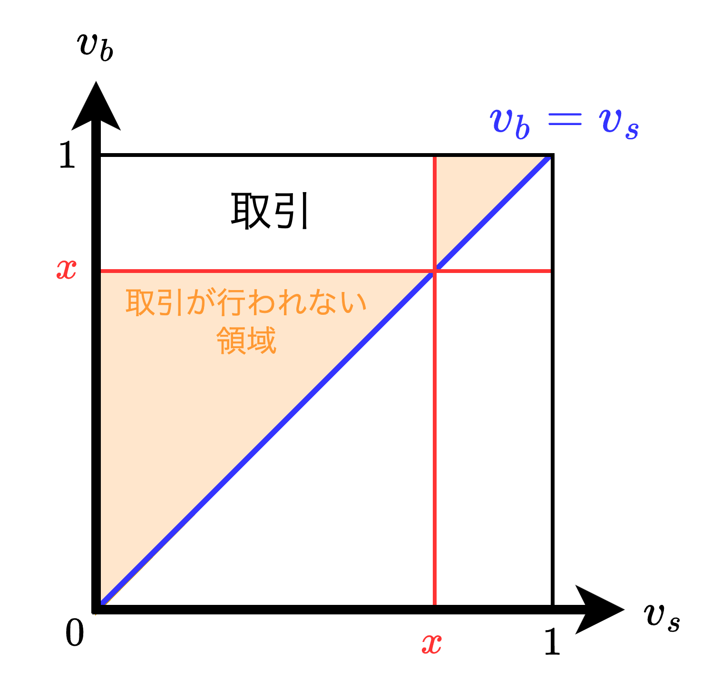

<div class="chap3">

# 不完備情報の静学ゲーム

- 本章では**不完備情報**ゲーム、すなわちベイジアンゲームの研究を始めることにする。不完備情報ゲームでは他のプレイヤーの利得関数に対して不確かなプレイヤーが少なくとも1人は存在する。
- 3.1節では、静学ベイジアンゲームの標準型とそこでのベイジアンナッシュ均衡を定義する。これらの定義は抽象的であるため、簡単な例として非対称情報の下でのクールノー競争の例を用いて、主要な概念を説明する。
- 3.2節では、①混合戦略の厳密な解釈、②オークションの分析、③ダブルオークションの分析、の3つの応用を考える。
  - 【**①混合戦略の厳密な解釈**】プレイヤー$j$の混合戦略が$j$の純粋戦略の選択に対するプレイヤー$i$の不確実性の表すものとし、他方$j$の選択はごくわずかな私的情報の値に依存して決まると考える。
  - 【**②オークションの分析**】入札者（買い手）の評価が私的情報であり、売り手の評価は既知である場合のオークションを分析する。
  - 【**③ダブルオークションの分析**】売り手と買い手がともに自分の評価に関して私的情報を持っている場合（例えば企業は労働者の限界生産力を知っており、労働者は自分が他にどんな仕事に就けるかを知っている場合）について考察する。これはダブルオークションと呼ばれ、売り手が販売希望価格を、買い手が購入希望価格を示し、価格の取引を行う。
- 3.3節では、顕示原理の主張とその証明を行う。そして、プレイヤーが私的情報を持つときにこの原理がゲームの設計にどのように適用できるかについて簡単に触れる。

## 【理論】静学ベイジアンゲームとベイジアンナッシュ均衡

### 【例】非対称情報の下でのクールノー競争

$$
\begin{align*}
    &Q=q_1+q_2
    \hspace{1mm},\hspace{2mm}
    P(Q)=a-Q
    \hspace{1mm},\hspace{2mm}
    C_1(q_1)=cq_1
    \hspace{1mm},\hspace{2mm}
    C_2(q_2)=\left\{
        \begin{array}{l}
            c_Hq_2\quad(確率\theta) \\[1mm]
            c_Lq_2\quad(確率1-\theta)
        \end{array}
    \right.
\end{align*}
$$

- ここで、企業1は自分の費用関数は知っていても企業2の限界費用についてはそれが確率$\theta$で$c_H$となり、確率$1-\theta$で$c_L$であることしか知らない。これは「企業2がこの産業に新規参入してきた」と解釈しても良いし、「企業2が新技術を開発したばかり」と解釈（仮定）しても良い。

<div style="page-break-before:always"></div>

#### ナッシュ均衡の導出

$$
\begin{align*}
    &\left\{\begin{array}{l}
        \displaystyle{\max_{q_2}\hspace{1mm}\pi_2(q_1^*,q_2^*(c_H))=[(a-q_1^*-q_2^*(c_H))-c_H]q_2^*(c_H)}\\[3mm]
        \displaystyle{\max_{q_2}\hspace{1mm}\pi_2(q_1^*,q_2^*(c_L))=[(a-q_1^*-q_2^*(c_L))-c_L]q_2^*(c_L)}\\[3mm]
        \displaystyle{\max_{q_1}\hspace{1mm}\pi_1(q_1,q_2^*)=\theta[(a-q_1-q_2^*(c_H))-c]q_1+(1-\theta)[(a-q_1-q_2^*(c_L))-c]q_1}
    \end{array}
    \right.\\
    &\left\{\begin{array}{l}
        \displaystyle{\frac{\partial\pi_2(q_1^*,q_2^*(c_H))}{\partial q_2}}=-q_1^*-2q_2^*(c_H)+a-c_H=0\\[3mm]
        \displaystyle{\frac{\partial\pi_2(q_1^*,q_2^*(c_L))}{\partial q_2}}=-q_1^*-2q_2^*(c_L)+a-c_L=0\\[3mm]
        \displaystyle{\frac{\partial\pi_1(q_1,q_2^*)}{\partial q_1}}=-2q_1^*-\theta q_2^*(c_H)-(1-\theta)q_2^*(c_L)+a-c=0
    \end{array}
    \right.\\[12mm]
    &q_2^*(c_H)=\frac{a-q_1^*-c_H}{2}とq_2^*(c_L)=\frac{a-q_1^*-c_L}{2}を\frac{\partial\pi_1(q_1,q_2^*)}{\partial q_1}=0に代入し、q_1^*を求める。\\[4mm]
    &\left\{\begin{array}{l}
        \displaystyle{q_1^*=\frac{a-2c+\theta c_H+(1-\theta)c_L}{3}}\\[3mm]
        \displaystyle{q_2^*(c_H)=\frac{a-2c_H+c}{3}+\frac{1-\theta}{6}(c_H-c_L)}\\[3mm]
        \displaystyle{q_2^*(c_L)=\frac{a-2c_L+c}{3}-\frac{\theta}{6}(c_H-c_L)}
    \end{array}
    \right.\\
\end{align*}
$$

#### 不完備情報のクールノー競争のナッシュ均衡の考察

- $q_1^*,q_2^*(c_H),q_2^*(c_L)$を完備情報のクールノー競争のナッシュ均衡と比較する。
  - 【**完備情報の場合**】例えば、費用$c_1$と$c_2$を用いると企業$i$の均衡生産量は$q_i=\frac{a-2c_i-c_j}{3}$である。
  - 【**不完備情報の場合**】$q_2^*(c_H)$は$\frac{a-2c_H-c}{3}$より（$\frac{(1-\theta)(c_H-c_L)}{6}$だけ）多く生産し、$q_2^*(c_L)$は$\frac{a-2c_L-c}{3}$より（$\frac{\theta(c_H-c_L)}{6}$だけ）少なく生産する。
- 上記のように不完備情報の場合、企業2の費用$c_H,c_L$が高くなればなるほど企業2の生産量が減少する一方で、企業1の生産量は増加する。これは、企業1が企業2の費用が高いと判断すれば市場シェアを奪おうとして$q_1^*$を増やし、逆に企業2の費用が低いと判断すれば市場シェアを奪われないように企業1の費用$c$を減らし、$q_1^*$を増やすからである。

<div style="page-break-before:always"></div>

### 静学ベイジアンゲームの標準型による表現

#### 【振り返り】<font color=red><b>完備</b></font>情報の$n$人ゲーム$G$の標準型

- 使用するパラメータ
  - $S_i（1\leqq i\leqq n）$：プレイヤー$i$の戦略空間
  - $u_i（1\leqq i\leqq n）$：プレイヤー$i$の利得関数
- 静学ゲームの手順
  1. プレイヤー$i$は同時に戦略$s_i$（＝行動$a_i$）を選ぶ。
  2. プレイヤー$i$は利得$u_i(s_1,\cdots,s_n)$を受け取る。

#### 【本章で扱う】<font color=red><b>不完備</b></font>情報の同時手番ゲーム$G$の標準型

- 使用するパラメータ
  - $A_i（1\leqq i\leqq n）$：プレイヤー$i$の行動空間
  - $u_i（1\leqq i\leqq n）$：プレイヤー$i$の利得関数
  - $T_i（1\leqq i\leqq n）$：プレイヤー$i$のタイプ空間
  - $p_i（1\leqq i\leqq n）$：プレイヤー$i$の確率分布（$t_{-i}$に関する信念）
- 静学ベイジアンゲームの手順
  1. 自然がそれぞれの$t_i$を可能なタイプの集合$T_i$から選択し、プレイヤーのタイプベクトル$t=(t_1,\cdots,t_n)$を決定する。
  2. 自然は$t_i$をプレイヤー$i$には明かすが、他のプレイヤーには明かさない。
  3. 各プレイヤー$i$はその行動$a_i$を実行可能集合$A_i$から同時に選択する。
  4. プレイヤー$i$は利得$u_i(a_1,\cdots,a_n;t_i)$が受け取られる。
- 不完備情報では$i$は自身の利得関数は知っているが、他のプレイヤーの利得関数は不確かであるという状況を扱う。そこで、プレイヤー$i$の可能な利得関数を$u_i(a_1,\cdots,a_n;t_i)$で表す。
- ここで$t_i$は$i$の**タイプ**と呼び、これにより$i$は複数の利得関数を定義することができる。例えば、前節のクールノーゲームの場合、$\pi_2(q_1,q_2;c_H)$、$\pi_2(q_1,q_2;c_L)$は、それぞれ企業2のタイプが$c_H$、$c_L$のときの利得関数である。同様に、$\pi_1(q_1,q_2;c)$は企業1のタイプが$c$の利得関数である。

<div style="page-break-before:always"></div>

#### 静学ベイジアンゲームの定義

```plantuml
title 静学ベイジアンゲームの依存関係
left to right direction

rectangle "ゲームG" as g
rectangle "行動空間A" as a
rectangle "戦略空間S" as s
rectangle "タイプ空間T" as t
rectangle "信念p" as p
rectangle "利得関数u" as u

g <-- a
g <-- p
g <-- t
g <-- u
a --> s
t --> s

note right of s
  行動空間と
  タイプ空間に
  よって決まる
end note
```

$$
p(t_{-i}|t_i)=\frac{p(t_{-i},t_i)}{p(t_i)}=\frac{p(t_{-i},t_i)}{\displaystyle{\sum_{t_{-i}\in T_{-i}}p(t_{-i},t_i)}}
$$

> 【**定義：静学ベイジアンゲーム**】
> $n$人静学ベイジアンゲームの標準型による表現とは、プレイヤーの行動空間$A_1,\cdots,A_n$、タイプ空間$T_1,\cdots,T_n$、信念$p_1,\cdots,p_n$、利得関数$u_1,\cdots,u_n$および利得関数$u_1,\cdots,u_n$を特定化することである。このゲームを$G=\{A_1,\cdots,A_n\hspace{1mm};\hspace{1mm}T_1,\cdots,T_n\hspace{1mm};\hspace{1mm}p_1,\cdots,p_n\hspace{1mm};\hspace{1mm}u_1,\cdots,u_n\}$で表す。
> プレイヤー$i$のタイプ$t_i$はプレイヤー$i$が個人的に知っているもので、プレイヤー$i$の利得関数$u_i(a_1,\cdots,a_n;t_i)$を決定し、可能なタイプの集合$T_i$に属する。
> プレイヤー$i$の信念$p_i(t_{-i}|t_i)$は$i$自身のタイプ$t_i$を所与としたとき、他の$n-1$人のプレイヤーのタイプ$t_{-i}$に関する不確実性を表している。

- 上記の定義より、<u>「**自然**」とは不完全情報ゲームとして表現するための存在</u>である。これにより、プレイヤー$i$は$t_i$を知るが、プレイヤー$j$は$t_i$を知らないような<font color=red>不完全情報ゲームを表現できる</font>。

<div style="page-break-before:always"></div>

### ベイジアンナッシュ均衡の定義

#### ベイジアンゲームにおける戦略

> 【**定義：静学ベイジアンゲームにおける戦略**】
> 静学ベイジアンゲーム$G=\{A_1,\cdots,A_n\hspace{1mm};\hspace{1mm}T_1,\cdots,T_n\hspace{1mm};\hspace{1mm}p_1,\cdots,p_n\hspace{1mm};\hspace{1mm}u_1,\cdots,u_n\}$におけるプレイヤー$i$の戦略とは関数$s_i(t_i)$のことであり、それは$T_i$の各$t_i$に対し、もし自然によって$t_i$が選ばれたならそのタイプが実行可能集合$A_i$から選択するであろう行動$s_i(t_i)$を定めるものである。

- ベイジアンゲームでは、<font color=red>戦略空間が$G$に含まれておらず、$T_i$と$A_i$とを用いて構成される</font>。

#### ナッシュ均衡の定義

> 【**定義：静学ベイジアンゲームにおけるナッシュ均衡**】
> 静学ベイジアンゲーム$G$において、各プレイヤー$i$と$T_i$に属するタイプ$t_i$に対して、戦略$s^*=(s_1^*,\cdots,s_n^*)$が下式を満たすとき、ベイジアンナッシュ均衡であるという。
> $$
> \max_{a_i\in A_i}\hspace{1mm}\sum_{t_{-i}\in T_{-i}}u_i(s_{-i}^*(t_{-i}),a_i;t_i)p_i(t_{-i}|t_i)
> $$つまりどのプレイヤーも、その戦略をそれ以上変更したがらないということである。

- 有限の静学ベイジアンゲームにおいて、混合戦略を含むベイジアンナッシュ均衡は必ず存在する。この証明は完備情報の有限ゲームの場合と同様である。

<div style="page-break-before:always"></div>

## 【応用】

### 混合戦略再論

- **不完備情報の混合戦略ナッシュ均衡**は、完備情報の混合戦略ナッシュ均衡に「不完備情報」という条件が加わったものと解釈することができる。

#### 不完備情報を用いた両性の戦い

$$
\begin{align*}
    【ゲーム】&G=\{A_c,A_p\hspace{1mm};\hspace{1mm}T_c,T_p\hspace{1mm};\hspace{1mm}p_c,p_p\hspace{1mm};\hspace{1mm}u_c,u_p\}\\
    【行動】&A_c=A_p=\{オペラ、ボクシング\}\\
    【タイプ】&T_c=T_p=\{0,x\}\\
    【信念】&p_c(t_p)=p_p(t_c)=1/x
\end{align*}
$$

##### 両性の戦いの利得表

|                | オペラ      | ボクシング  |
| -------------- | ----------- | ----------- |
| **オペラ**     | $(2+t_c,1)$ | $(0,0)$     |
| **ボクシング** | $(0,0)$     | $(1,2+t_p)$ |

- 上表の行方向はクリス、列方向はパットの利得を表し、$t_c$はクリスだけが知っている値、$t_p$はパットだけが知っている値とする。
- ここでクリスがオペラを選ぶ臨界値$t_c=c$、パットがボクシングを選ぶ臨界値$t_p=p$を考える。
  - $c$: クリスがオペラを選ぶ臨界値。$t_c\geqq c$ならばクリスはオペラを選び、$t_c<c$ならばボクシングを選ぶ。
  - $p$: パットがボクシングを選ぶ臨界値。つまり$t_p\geqq p$ならばパットはボクシングを選び、$t_p<p$ならばオペラを選ぶ。

<div style="page-break-before:always"></div>

##### ベイジアンナッシュ均衡の導出

$$
\begin{align*}
    m_{c1}&=\frac{p}{x}(2+t_c)+\left(1-\frac{p}{x}\right)\cdot 0=\frac{p}{x}(2+t_c)\\[3mm]
    m_{c2}&=\frac{p}{x}\cdot 0+\left(1-\frac{p}{x}\right)\cdot 1=1-\frac{p}{x}\\[3mm]
    m_{p1}&=\left(1-\frac{c}{x}\right)\cdot 1+\frac{c}{x}\cdot 0=1-\frac{c}{x}\\[3mm]
    m_{p2}&=\left(1-\frac{c}{x}\right)\cdot 0+\frac{c}{x}\cdot (2+t_p)=\frac{c}{x}(2+t_p)
\end{align*}\\[2mm]
\begin{align*}
    &m_{c1}\geqq m_{c2}、m_{p1}\leqq m_{p2}が成り立つとき、臨界値cと臨界値pがそれぞれわかる
\end{align*}\\[1mm]
m_{c1}\geqq m_{c2}より、\frac{p}{x}(2+t_c)\geqq 1-\frac{p}{x}\hspace{1mm}\therefore\hspace{1mm}\color{red}\underline{t_c\geqq\frac{x}{p}-3=c}\color{black}\\[2mm]
m_{p1}\leqq m_{p2}より、1-\frac{c}{x}\leqq \frac{c}{x}(2+t_p)\hspace{1mm}\therefore\hspace{1mm}\color{red}\underline{t_p\geqq\frac{x}{c}-3=p}\color{black}\frac{}{}\\[2mm]
ここでp=c、p>0よりp^2+3p-x=0を解くとp=\frac{-3+\sqrt{9+4x}}{2}(=c)\\[3mm]
以上の結果からパットがオペラを選ぶ確率とクリスがボクシングを選ぶ確率を求める。\\[1mm]
1-\frac{p}{x}=1-\frac{c}{x}=1-\frac{-3+\sqrt{9+4x}}{2x}\\[2mm]
ここで、\lim_{x\rightarrow 0}\frac{p}{x}の値を求める。\\[2mm]
\begin{align*}
    \displaystyle\lim_{x\rightarrow 0}\frac{p}{x}&=\displaystyle\lim_{x\rightarrow 0}\frac{-3+\sqrt{9+4x}}{2x}=\displaystyle\lim_{x\rightarrow 0}\frac{-4x}{2x(-3-\sqrt{9+4x})}\\[3mm]
    &=\displaystyle\lim_{x\rightarrow 0}\frac{2}{3+\sqrt{9+4x}}=\displaystyle\frac{2}{3+\sqrt{9}}=\displaystyle\frac{1}{3}
\end{align*}\\[3mm]
このことから、\color{red}\underline{xが十分小さいとき、1-\frac{p}{x}\approx \frac{2}{3}、1-\frac{c}{x}\approx \frac{2}{3}となる}。
$$

- 上式のうち、$m_{c1}\geqq m_{c2}$はクリスがオペラを選ぶ最適条件、$m_{p1}\leqq m_{p2}$はパットがボクシングを選ぶ最適条件を示す。また、$m_{c1},m_{c2},m_{p1},m_{p2}$はそれぞれ以下の通り。
  - $m_{c1}$: クリスがオペラを選ぶ期待利得
  - $m_{c2}$: クリスがボクシングを選ぶ期待利得
  - $m_{p1}$: パットがオペラを選ぶ期待利得
  - $m_{p2}$: パットがボクシングを選ぶ期待利得
- 上式の最終結果から、<font color=red>不完備性が消失していけば（$x\rightarrow 0$）、不完備情報ゲームのベイジアンナッシュ均衡でのプレイヤーの行動がもとの完備情報ゲームの混合戦略ナッシュ均衡の行動に近づくことがわかった</font>。

<div style="page-break-before:always"></div>

### オークション

$$
\begin{align*}
    A_i&=[0,\infty)\\[1mm]
    u_i(b_1,b_2;v_1,v_2)&=\left\{\begin{array}{cl}
        v_i-b_i & (b_i>b_j)\\[2mm]
        \displaystyle\frac{v_i-b_i}{2} & (b_i=b_j)\\[2mm]
        0 & (b_i<b_j)
    \end{array}\right.\\[1mm]
    T_i&=[0,1]\\[2mm]
    p_i&=\int_a^b1\cdot dv=[v]_a^b
\end{align*}\\[2mm]
\begin{align*}
    v_i&：財に対する評価\\
    b_i&：入札者iが競り落とすために支払う価格\\
\end{align*}
$$

- 以下の共有知識を前提としてオークションを考える。
  - 入札者は2人で$i=1,2$として区別し、入札者のその財に対する評価$v_i$を行った後、競り落とす価格$p$を支払う。評価$v$は$[0,1]$の一様分布に従う。
  - 入札者$i$の利得は$v_i-p$となる。
  - より高い値をつけた方が財を勝ち取って付け値を支払う。もう一人の入札者は何も受け取らず何も支払わない。
  - 付け値が等しい場合はコインを投げて勝者を決める。

<div style="page-break-before:always"></div>

#### ベイジアンナッシュ均衡の導出

$$
\begin{align*}
    \pi_i(b_i,b_j)&=(v_i-b_i)p_i(b_i>b_j)+\frac{v_i-b_i}{2}p_i(b_i=b_j)+0\cdot p_i(b_i<b_j)\\[1mm]
    &=(v_i-b_i)\int_{0}^{\frac{b_j-a_j}{c_j}}1\cdot dv+\frac{v_i-b_i}{2}\int_{\frac{b_j-a_j}{c_j}}^{\frac{b_j-a_j}{c_j}}1\cdot dv=(v_i-b_i)\cdot\frac{b_i-a_j}{c_j}\\[1mm]
    &=\frac{1}{c_j}\left[-b_i^2+(a_j+v_i)b_i-a_jv_i\right]
\end{align*}\\[3mm]
\max_{b_i}\hspace{2mm}\pi_i(b_i,b_j(v_j))\iff\frac{\partial\pi_i}{\partial b_i}=\frac{1}{c_j}\left[-2b_i+(a_j+v_i)\right]=0\\[3mm]
b_i=\left\{\begin{array}{cl}
    \displaystyle\frac{a_j}{2}+\frac{v_i}{2} & (v_i\geqq a_jのとき)\\[2mm]
    a_j & (v_i<a_jのとき)
\end{array}
\right.
$$

- 上式の補足として、$b_i$は評価$v_i$に対する入札者$i$の落札価格であり、$b_i=a_i+c_iv_i$とする。
- ここで、もし$0<a_j<1$であれば$v_i<a_j$となるような$v_i$が存在してしまい、$b_i$は線形ではなくなってしまう。具体的にははじめ水平でその後に正の傾きをもつような関数となる。
- プレイヤー$i$が戦略$b_i=a_i+c_iv_i$を採用するという仮定のもとでプレイヤー$j$に対しても繰り返すことができる。その結果は<font color=Red>$a_i\leqq 0,a_j=\frac{a_i}{2},c_j=\frac{1}{2}$となる。したがって、$a_i=a_j=0,c_i=c_j=\frac{1}{2}$が導かれる</font>。

<div style="page-break-before:always"></div>

### ダブルオークション

$$
\begin{align*}
    \pi_b(\color{red}p_s\color{black},\color{blue}p_b\color{black})&=\left[
        v_b-\frac{\color{blue}p_b\color{black}+E[\color{red}p_s\color{black}(v_s)|\color{blue}p_b\color{black}\geqq \color{red}p_s\color{black}(v_s)]}{2}
    \right]Prob(\color{blue}p_b\color{black}\geqq \color{red}p_s\color{black}(v_s))\\[3mm]
    \pi_s(\color{red}p_s\color{black},\color{blue}p_b\color{black})&=\left[
        \frac{\color{red}p_s\color{black}+E[\color{blue}p_b\color{black}(v_b)|\color{blue}p_b\color{black}(v_b)\geqq \color{red}p_s\color{black}]}{2}-v_s
    \right]Prob(\color{blue}p_b\color{black}(v_b)\geqq \color{red}p_s\color{black})
\end{align*}\\[3mm]
\begin{align*}
    取引価格\quad p&=\left\{
        \begin{array}{cl}
            \displaystyle\frac{p_b+p_s}{2} & (p_b\geqq p_s)\\[3mm]
            0 & (p_b<p_s)\\
        \end{array}
    \right.\\[4mm]
    売り手の効用関数\quad u_s&=\left\{
        \begin{array}{cl}
            p-v_s & (p>0)\\[3mm]
            0 & (p=0)\\
        \end{array}
    \right.\\[4mm]
    買い手の効用関数\quad u_b&=\left\{
        \begin{array}{cl}
            v_b-p & (p>0)\\[3mm]
            0 & (p=0)\\
        \end{array}
    \right.\\[3mm]    
\end{align*}
$$

- オークションに続いて、ダブルオークション（売り手と買い手それぞれが自分の評価について指摘情報を持っている状況）を考える。売り手は販売希望価格$p_s$を提示し、買い手は購入希望価格$p_b$を提示する。取引価格は上式で与えられる。ここで、<font color=red>売り手と買い手の評価$v_s,v_b$は$[0,1]$の一様分布に従う</font>。
- 上式の補足を以下に示す。
  - $E[\color{red}p_s\color{black}(v_s)|\color{blue}p_b\color{black}\geqq \color{red}p_s\color{black}(v_s)]$：売り手の要求が買い手の申し出$p_b$より小さいという条件の下での売り手の要求する価格の期待値
  - $E[\color{blue}p_b\color{black}(v_b)|\color{blue}p_b\color{black}(v_b)\geqq \color{red}p_s\color{black}]$：買い手の申し出が売り手の要求金額$p_s$よりも大きいという条件の下での買い手の申し出価格の期待値

#### ベイジアンナッシュ均衡の導出

$$
\max_{p_b}\hspace{1mm}\pi_b(p_s,p_b)\hspace{.5mm},\hspace{2mm}\max_{p_s}\hspace{1mm}\pi_s(p_s,p_b)\\[2mm]
\\
$$


##### ベイジアンナッシュ均衡の図的解釈



<div style="page-break-before:always"></div>

## 顕示原理


<div style="page-break-before:always"></div>

## 読書案内


## 練習問題


## 参考文献


</div>